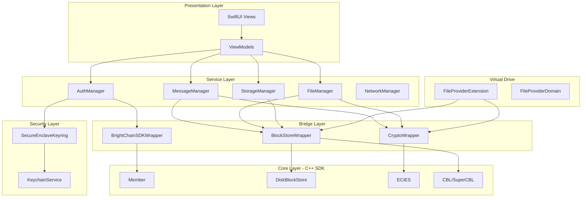
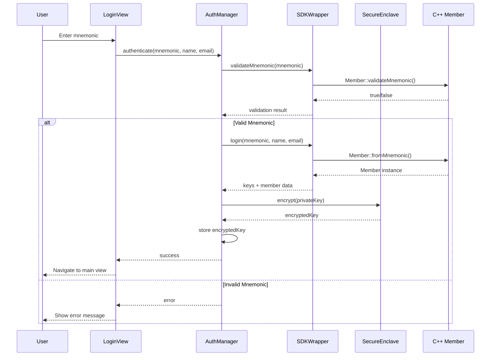

# Design Document: BrightChain macOS Client

## Overview

The BrightChain macOS Client is a native SwiftUI application that provides a comprehensive interface to the BrightChain distributed storage and encrypted communication system. The application leverages the existing C++ BrightChain SDK through an Objective-C++ bridge layer, with hardware-backed key security via macOS Secure Enclave.

The architecture follows a layered approach:
1. **Presentation Layer**: SwiftUI views with MVVM pattern
2. **Service Layer**: Swift services coordinating business logic
3. **Bridge Layer**: Objective-C++ wrappers exposing C++ SDK functionality
4. **Core Layer**: C++ BrightChain SDK (member management, block storage, cryptography)

Key design decisions:
- Use Secure Enclave for hardware-backed private key protection
- Implement virtual drive using macOS File Provider extension
- Store all user data as encrypted blocks in the local BlockStore
- Support offline operation with sync-on-reconnect capability

## Architecture



### Component Interaction Flow



## Components and Interfaces

### 1. Authentication Components

#### AuthManager
```swift
protocol AuthManagerProtocol {
    var currentMember: MemberModel? { get }
    var isAuthenticated: Bool { get }
    
    func register(name: String, email: String) async throws -> (member: MemberModel, mnemonic: String)
    func login(mnemonic: String, name: String, email: String) async throws -> MemberModel
    func logout() async
    func validateMnemonic(_ mnemonic: String) -> Bool
}

class AuthManager: ObservableObject, AuthManagerProtocol {
    @Published private(set) var currentMember: MemberModel?
    private let sdkWrapper: BrightChainSDKWrapper
    private let keyring: SecureEnclaveKeyring
    private let keychain: KeychainService
}
```

#### SecureEnclaveKeyring (Enhanced)
```swift
protocol KeyringProtocol {
    func encrypt(data: Data) throws -> Data
    func decrypt(encryptedData: Data) throws -> Data
    func deleteKey() throws
    func hasKey() -> Bool
}

class SecureEnclaveKeyring: KeyringProtocol {
    private let tag: String
    private let accessControl: SecAccessControl
    
    func getOrCreateEnclaveKey() throws -> SecKey
    func encrypt(data: Data) throws -> Data
    func decrypt(encryptedData: Data) throws -> Data
    func deleteKey() throws
}
```

### 2. Messaging Components

#### MessageManager
```swift
protocol MessageManagerProtocol {
    var conversations: [Conversation] { get }
    
    func loadConversations() async throws
    func createConversation(with recipients: [MemberId]) async throws -> Conversation
    func sendMessage(to conversation: Conversation, content: MessageContent) async throws -> Message
    func loadMessages(for conversation: Conversation, limit: Int, before: Date?) async throws -> [Message]
    func deleteConversation(_ conversation: Conversation) async throws
}

class MessageManager: ObservableObject, MessageManagerProtocol {
    @Published private(set) var conversations: [Conversation] = []
    private let blockStore: BlockStoreService
    private let cryptoService: CryptoService
    private let authManager: AuthManager
}
```

#### CryptoService
```swift
protocol CryptoServiceProtocol {
    func encrypt(data: Data, for recipients: [Data]) throws -> Data
    func decrypt(data: Data, with privateKey: Data) throws -> Data
    func sign(data: Data, with privateKey: Data) throws -> Data
    func verify(signature: Data, for data: Data, with publicKey: Data) -> Bool
}

class CryptoService: CryptoServiceProtocol {
    private let wrapper: CryptoWrapper
}
```

### 3. File Sharing Components

#### FileShareManager
```swift
protocol FileShareManagerProtocol {
    func uploadFile(at url: URL, for recipients: [MemberId], progress: @escaping (Double) -> Void) async throws -> FileReference
    func downloadFile(reference: FileReference, to destination: URL, progress: @escaping (Double) -> Void) async throws
    func parseReference(from string: String) throws -> FileReference
    func generateMagnetURL(for reference: FileReference) -> String
}

class FileShareManager: ObservableObject, FileShareManagerProtocol {
    private let blockStore: BlockStoreService
    private let cryptoService: CryptoService
    
    func splitFileIntoBlocks(url: URL) throws -> [BlockData]
    func reassembleFile(from blocks: [BlockData], to url: URL) throws
    func createCBL(for blocks: [Checksum], metadata: FileMetadata) throws -> CBLReference
    func createSuperCBL(for cbls: [CBLReference], metadata: FileMetadata) throws -> SuperCBLReference
}
```

### 4. Storage Components

#### BlockStoreService (Enhanced)
```swift
protocol BlockStoreServiceProtocol {
    func store(data: Data, size: BlockSize) throws -> Checksum
    func retrieve(checksum: Checksum) throws -> Data
    func exists(checksum: Checksum) -> Bool
    func delete(checksum: Checksum) throws -> Bool
    func getStorageStats() -> StorageStats
    func cleanup(policy: CleanupPolicy) async throws -> CleanupResult
}

class BlockStoreService: ObservableObject, BlockStoreServiceProtocol {
    private let wrapper: BlockStoreWrapper
    private let storePath: URL
    
    @Published private(set) var stats: StorageStats
}
```

#### StorageManager
```swift
protocol StorageManagerProtocol {
    var storageStats: StorageStats { get }
    var storageLimit: UInt64 { get set }
    
    func getUsageByCategory() -> [StorageCategory: UInt64]
    func setStorageLimit(_ limit: UInt64) throws
    func performCleanup() async throws -> CleanupResult
    func verifyIntegrity() async throws -> IntegrityReport
}
```

### 5. Virtual Drive Components

#### VirtualDriveManager
```swift
protocol VirtualDriveManagerProtocol {
    var isMounted: Bool { get }
    var mountPoint: URL { get }
    var availableContent: [VirtualFileEntry] { get }
    
    func mount(at path: URL) async throws
    func unmount() async throws
    func importReference(_ reference: FileReference) async throws
    func removeContent(_ entry: VirtualFileEntry) async throws
}

class VirtualDriveManager: ObservableObject, VirtualDriveManagerProtocol {
    @Published private(set) var isMounted: Bool = false
    @Published private(set) var availableContent: [VirtualFileEntry] = []
    
    private let fileProvider: FileProviderService
    private let blockStore: BlockStoreService
    private let catalog: ContentCatalog
}
```

#### FileProviderExtension
```swift
// Implemented as a separate File Provider extension target
class BrightChainFileProviderExtension: NSFileProviderExtension {
    func item(for identifier: NSFileProviderItemIdentifier) throws -> NSFileProviderItem
    func urlForItem(withPersistentIdentifier identifier: NSFileProviderItemIdentifier) -> URL?
    func providePlaceholder(at url: URL) throws
    func startProvidingItem(at url: URL) throws
    func stopProvidingItem(at url: URL)
}
```

### 6. Network Components

#### NetworkManager
```swift
protocol NetworkManagerProtocol {
    var connectionStatus: ConnectionStatus { get }
    var connectedPeers: [PeerInfo] { get }
    
    func connect() async throws
    func disconnect() async
    func requestBlock(checksum: Checksum) async throws -> Data
    func announceBlock(checksum: Checksum) async
    func syncPendingOperations() async throws
}

class NetworkManager: ObservableObject, NetworkManagerProtocol {
    @Published private(set) var connectionStatus: ConnectionStatus = .disconnected
    @Published private(set) var connectedPeers: [PeerInfo] = []
    
    private var pendingOperations: [PendingOperation] = []
    private let endpoints: [NetworkEndpoint]
}
```

### 7. SDK Bridge Components

#### BrightChainSDKWrapper (Enhanced)
```objc
@interface BrightChainSDKWrapper : NSObject

// Member operations
- (BOOL)validateMnemonic:(NSString *)mnemonic;
- (NSString *)generateMnemonic;
- (NSDictionary *)loginWithMnemonic:(NSString *)mnemonic name:(NSString *)name email:(NSString *)email;
- (NSDictionary *)createMemberWithMnemonic:(NSString *)mnemonic name:(NSString *)name email:(NSString *)email;

// Signing operations
- (NSData *)signData:(NSData *)data withPrivateKey:(NSData *)privateKey;
- (BOOL)verifySignature:(NSData *)signature forData:(NSData *)data withPublicKey:(NSData *)publicKey;

@end
```

#### BlockStoreWrapper
```objc
@interface BlockStoreWrapper : NSObject

- (instancetype)initWithStorePath:(NSString *)path blockSize:(NSInteger)blockSize;
- (NSString *)storeBlock:(NSData *)data;
- (NSString *)storeBlock:(NSData *)data withMetadata:(NSDictionary *)metadata;
- (NSData *)getBlock:(NSString *)checksum;
- (BOOL)hasBlock:(NSString *)checksum;
- (BOOL)deleteBlock:(NSString *)checksum;
- (NSDictionary *)getMetadata:(NSString *)checksum;
- (NSDictionary *)getStats;

@end
```

#### CryptoWrapper
```objc
@interface CryptoWrapper : NSObject

// ECIES operations
- (NSData *)encryptData:(NSData *)data forRecipient:(NSData *)publicKey;
- (NSData *)encryptData:(NSData *)data forRecipients:(NSArray<NSData *> *)publicKeys;
- (NSData *)decryptData:(NSData *)data withPrivateKey:(NSData *)privateKey;

// CBL operations
- (NSDictionary *)createCBL:(NSArray<NSString *> *)checksums 
                  creatorId:(NSData *)creatorId 
                 privateKey:(NSData *)privateKey
           originalChecksum:(NSString *)originalChecksum
         originalDataLength:(uint64_t)length;

- (NSDictionary *)parseCBL:(NSData *)cblData;
- (NSArray<NSString *> *)getCBLAddresses:(NSData *)cblData;

@end
```

## Data Models

### Member and Authentication

```swift
struct MemberModel: Identifiable, Codable {
    let id: UUID
    let memberId: Data  // 16-byte BrightChain member ID
    let name: String
    let email: String
    let memberType: MemberType
    let publicKey: Data
    let dateCreated: Date
    var dateUpdated: Date
    
    enum MemberType: String, Codable {
        case admin, system, user, anonymous
    }
}

struct SessionState: Codable {
    let memberId: Data
    let encryptedPrivateKey: Data
    let loginTime: Date
    var lastActivity: Date
}
```

### Messaging

```swift
struct Conversation: Identifiable, Codable {
    let id: UUID
    let participants: [Data]  // Member IDs
    let createdAt: Date
    var lastMessageAt: Date?
    var lastMessagePreview: String?
    var unreadCount: Int
}

struct Message: Identifiable, Codable {
    let id: UUID
    let conversationId: UUID
    let senderId: Data
    let timestamp: Date
    let content: MessageContent
    let cblChecksum: String
    var status: MessageStatus
    
    enum MessageStatus: String, Codable {
        case sending, sent, delivered, read, failed
    }
}

struct MessageContent: Codable {
    let text: String?
    let attachments: [AttachmentReference]?
}

struct AttachmentReference: Codable {
    let filename: String
    let mimeType: String
    let size: UInt64
    let cblChecksum: String
}
```

### File Sharing

```swift
struct FileReference: Codable {
    let type: ReferenceType
    let checksum: String
    let filename: String
    let mimeType: String
    let size: UInt64
    let createdAt: Date
    let creatorId: Data?
    
    enum ReferenceType: String, Codable {
        case cbl, superCBL, magnetURL
    }
}

struct CBLReference: Codable {
    let checksum: String
    let blockChecksums: [String]
    let originalChecksum: String
    let originalSize: UInt64
    let tupleSize: Int
    let signature: Data
}

struct SuperCBLReference: Codable {
    let checksum: String
    let subCBLChecksums: [String]
    let totalBlockCount: Int
    let depth: Int
    let originalChecksum: String
    let originalSize: UInt64
    let signature: Data
}

struct MagnetURL {
    let infoHash: String
    let displayName: String?
    let size: UInt64?
    let checksums: [String]
    
    func toString() -> String
    static func parse(_ urlString: String) throws -> MagnetURL
}
```

### Storage

```swift
struct StorageStats: Codable {
    let totalUsed: UInt64
    let totalAvailable: UInt64
    let blockCounts: [BlockSize: Int]
    let categoryUsage: [StorageCategory: UInt64]
}

enum StorageCategory: String, Codable {
    case messages, files, system, cache
}

enum BlockSize: Int, Codable {
    case message = 512
    case tiny = 1024
    case small = 4096
    case medium = 1048576
    case large = 67108864
    case huge = 268435456
}

struct CleanupPolicy: Codable {
    let maxAge: TimeInterval?
    let maxSize: UInt64?
    let preserveCategories: [StorageCategory]
    let orphanedBlocksOnly: Bool
}

struct CleanupResult: Codable {
    let blocksRemoved: Int
    let bytesFreed: UInt64
    let errors: [String]
}

struct IntegrityReport: Codable {
    let totalBlocks: Int
    let verifiedBlocks: Int
    let corruptedBlocks: [String]
    let missingBlocks: [String]
}
```

### Virtual Drive

```swift
struct VirtualFileEntry: Identifiable, Codable {
    let id: UUID
    let filename: String
    let mimeType: String
    let size: UInt64
    let reference: FileReference
    let addedAt: Date
    var isAvailable: Bool
    var missingBlocks: [String]?
}

struct ContentCatalog: Codable {
    var entries: [VirtualFileEntry]
    var lastUpdated: Date
    
    mutating func add(_ entry: VirtualFileEntry)
    mutating func remove(id: UUID)
    func find(checksum: String) -> VirtualFileEntry?
}
```

### Network

```swift
enum ConnectionStatus: String, Codable {
    case disconnected, connecting, connected, error
}

struct PeerInfo: Identifiable, Codable {
    let id: String
    let endpoint: String
    let connectedAt: Date
    var lastActivity: Date
    var blocksExchanged: Int
}

struct NetworkEndpoint: Codable {
    let host: String
    let port: Int
    let isDefault: Bool
}

struct PendingOperation: Codable {
    let id: UUID
    let type: OperationType
    let data: Data
    let createdAt: Date
    var retryCount: Int
    
    enum OperationType: String, Codable {
        case blockRequest, blockAnnounce, messageSend
    }
}
```

### Settings

```swift
struct AppSettings: Codable {
    var storagePath: URL
    var storageLimit: UInt64
    var virtualDriveMountPoint: URL
    var virtualDriveEnabled: Bool
    var networkEndpoints: [NetworkEndpoint]
    var autoConnect: Bool
    var cacheSize: UInt64
    var logLevel: LogLevel
    
    enum LogLevel: String, Codable {
        case debug, info, warning, error
    }
    
    static var `default`: AppSettings
}
```


## Correctness Properties

*A property is a characteristic or behavior that should hold true across all valid executions of a system—essentially, a formal statement about what the system should do. Properties serve as the bridge between human-readable specifications and machine-verifiable correctness guarantees.*

### Authentication Properties

**Property 1: Mnemonic Generation Validity**
*For any* registration request, the generated mnemonic SHALL be a valid BIP39 12-word mnemonic that passes checksum validation.
**Validates: Requirements 1.2**

**Property 2: Mnemonic Validation Correctness**
*For any* string input, the mnemonic validator SHALL return true if and only if the string is a valid BIP39 mnemonic with correct checksum.
**Validates: Requirements 2.2**

**Property 3: Key Derivation Determinism**
*For any* valid BIP39 mnemonic, deriving keys using BIP44 path m/44'/0'/0'/0/0 SHALL always produce identical secp256k1 key pairs.
**Validates: Requirements 1.4, 2.4**

**Property 4: Secure Enclave Encryption Round-Trip**
*For any* data encrypted using the Secure Enclave key, decrypting with the same enclave key SHALL return the original data unchanged.
**Validates: Requirements 1.5, 3.2**

### Messaging Properties

**Property 5: Conversation ID Uniqueness**
*For any* set of created conversations, all conversation identifiers SHALL be unique (no duplicates).
**Validates: Requirements 4.3**

**Property 6: Conversation Display Completeness**
*For any* conversation with messages, the display representation SHALL include the most recent message preview and timestamp.
**Validates: Requirements 4.4**

**Property 7: Conversation Deletion Block Preservation**
*For any* conversation deletion, all blocks referenced by the conversation's messages SHALL remain in the BlockStore after deletion.
**Validates: Requirements 4.6**

**Property 8: Message Encryption Round-Trip**
*For any* message encrypted for a set of recipients using ECIES, each recipient SHALL be able to decrypt the message to obtain the original content using their private key.
**Validates: Requirements 5.1, 5.4**

**Property 9: Message Storage Block Creation**
*For any* sent message, the BlockStore SHALL contain blocks representing the encrypted message content.
**Validates: Requirements 5.2**

**Property 10: CBL Block Reference Integrity**
*For any* CBL created for a message or file, the CBL SHALL contain references to all constituent blocks, and all referenced checksums SHALL correspond to existing blocks.
**Validates: Requirements 5.3, 6.4**

**Property 11: Message Display Completeness**
*For any* displayed message, the rendering SHALL include sender identity, timestamp, and decrypted content.
**Validates: Requirements 5.5**

**Property 12: Attachment Block Separation**
*For any* message with attachments, each attachment SHALL be stored as separate encrypted blocks with its own CBL reference.
**Validates: Requirements 5.7**

### File Sharing Properties

**Property 13: File Block Size Selection**
*For any* file being uploaded, the splitting algorithm SHALL produce blocks of valid BrightChain block sizes (512B, 1KB, 4KB, 1MB, 64MB, or 256MB) appropriate for the file size.
**Validates: Requirements 6.2**

**Property 14: Block Encryption for Recipients**
*For any* file block encrypted for a set of recipients, each recipient SHALL be able to decrypt the block using their private key.
**Validates: Requirements 6.3**

**Property 15: Reference Generation Parseability**
*For any* generated file reference (Magnet URL or CBL file), parsing the reference SHALL extract the correct checksums and metadata.
**Validates: Requirements 6.5**

**Property 16: Magnet URL Parse Round-Trip**
*For any* valid Magnet URL, parsing then regenerating the URL SHALL produce an equivalent reference containing the same checksums and metadata.
**Validates: Requirements 7.1**

**Property 17: CBL Parse Correctness**
*For any* valid CBL data, parsing SHALL extract the correct block checksums, original data length, and creator signature.
**Validates: Requirements 7.2**

**Property 18: File Split-Reassemble Round-Trip**
*For any* file, splitting into blocks, storing, retrieving, and reassembling SHALL produce a file identical to the original (same content and checksum).
**Validates: Requirements 7.5**

### Storage Properties

**Property 19: Storage Categorization Consistency**
*For any* storage statistics query, the sum of category-specific usage (messages, files, system, cache) SHALL equal the total storage used.
**Validates: Requirements 8.2**

**Property 20: Storage Limit Enforcement**
*For any* block storage attempt when storage usage equals or exceeds the configured limit, the operation SHALL be rejected.
**Validates: Requirements 8.3**

**Property 21: Orphan Cleanup Safety**
*For any* cleanup operation targeting orphaned blocks, only blocks not referenced by any CBL or SuperCBL SHALL be removed.
**Validates: Requirements 8.5**

**Property 22: CBL Reference Consistency After Deletion**
*For any* block deletion, no CBL in the system SHALL reference the deleted block's checksum.
**Validates: Requirements 8.6**

**Property 23: Block Integrity Verification**
*For any* block in the BlockStore, the stored checksum SHALL match the SHA3-512 hash computed from the block data.
**Validates: Requirements 8.7**

### Virtual Drive Properties

**Property 24: Virtual Drive File Listing Completeness**
*For any* mounted virtual drive, all files with valid and complete CBL references in the catalog SHALL appear in the file listing.
**Validates: Requirements 9.2**

**Property 25: Virtual Drive File Operations**
*For any* file in the virtual drive with all blocks available, standard file operations (read, stat) SHALL return correct data matching the original file.
**Validates: Requirements 9.7**

**Property 26: Content Import Catalog Addition**
*For any* successfully imported reference (Magnet URL, CBL, or SuperCBL), the content catalog SHALL contain an entry for the imported content.
**Validates: Requirements 10.1, 10.2, 10.3**

**Property 27: Metadata Preservation on Import**
*For any* imported content, the virtual drive entry SHALL display the original filename and metadata from the reference.
**Validates: Requirements 10.4**

**Property 28: Availability Status Accuracy**
*For any* file in the virtual drive, the availability status SHALL be "unavailable" if and only if one or more referenced blocks are not present in the local BlockStore.
**Validates: Requirements 10.5**

**Property 29: Catalog Completeness**
*For any* imported content reference, the content catalog SHALL maintain a persistent record of the import.
**Validates: Requirements 10.7**

### BlockStore Properties

**Property 30: BlockStore Directory Structure**
*For any* stored block, the block file SHALL be located at the path: `{storePath}/{blockSize}/{checksum[0:2]}/{checksum[2:4]}/{checksum}`.
**Validates: Requirements 11.1**

**Property 31: BlockStore Checksum Verification**
*For any* block stored and subsequently retrieved, the computed SHA3-512 checksum of the retrieved data SHALL match the original storage checksum.
**Validates: Requirements 11.2, 11.3**

**Property 32: BlockStore Block Size Support**
*For any* valid block size (Message, Tiny, Small, Medium, Large, Huge), the BlockStore SHALL successfully store and retrieve blocks of that size.
**Validates: Requirements 11.4**

**Property 33: BlockStore Metadata Creation**
*For any* block stored with metadata, a corresponding metadata file SHALL exist at `{blockPath}.m.json` containing the provided metadata.
**Validates: Requirements 11.5**

**Property 34: BlockStore Statistics Accuracy**
*For any* BlockStore, the reported statistics SHALL accurately reflect the count and total size of stored blocks by block size category.
**Validates: Requirements 11.7**

### Network Properties

**Property 35: Block Serving Policy Enforcement**
*For any* block request from a peer, the response SHALL comply with the configured sharing policy (serve if policy allows, reject otherwise).
**Validates: Requirements 12.4**

### Settings Properties

**Property 36: Settings Persistence Round-Trip**
*For any* settings configuration saved to storage, loading the settings SHALL return values identical to those that were saved.
**Validates: Requirements 13.7**

### Error Handling Properties

**Property 37: Failed Operation Queuing**
*For any* network operation that fails due to connectivity issues, the operation SHALL be added to the pending operations queue for retry.
**Validates: Requirements 14.4**

## Error Handling

### Error Categories

1. **Authentication Errors**
   - Invalid mnemonic format or checksum
   - Key derivation failure
   - Secure Enclave unavailable
   - Biometric authentication failure

2. **Cryptographic Errors**
   - ECIES encryption/decryption failure
   - Signature verification failure
   - Key format errors

3. **Storage Errors**
   - Disk full / storage limit reached
   - Block corruption detected
   - File system permission errors
   - Metadata parsing errors

4. **Network Errors**
   - Connection timeout
   - Peer unavailable
   - Protocol errors
   - Block not found on network

5. **Virtual Drive Errors**
   - Mount failure
   - File Provider extension errors
   - Missing blocks for file access

### Error Handling Strategy

```swift
enum BrightChainError: Error {
    case authentication(AuthError)
    case cryptographic(CryptoError)
    case storage(StorageError)
    case network(NetworkError)
    case virtualDrive(VirtualDriveError)
    
    var isRecoverable: Bool
    var userMessage: String
    var technicalDetails: String
    var suggestedActions: [RecoveryAction]
}

enum RecoveryAction {
    case retry
    case checkNetwork
    case freeStorage
    case contactSupport
    case restartApp
}
```

### Error Recovery Patterns

1. **Automatic Retry**: Network operations automatically retry with exponential backoff
2. **Graceful Degradation**: Offline mode when network unavailable
3. **User Notification**: Clear error messages with actionable suggestions
4. **Logging**: Detailed logs for debugging without exposing sensitive data
5. **Data Isolation**: Corrupted data isolated to prevent cascade failures

## Testing Strategy

### Dual Testing Approach

This project uses both unit tests and property-based tests for comprehensive coverage:

- **Unit Tests**: Verify specific examples, edge cases, and error conditions
- **Property Tests**: Verify universal properties across randomly generated inputs

### Testing Framework

- **Unit Testing**: XCTest (Swift native)
- **Property-Based Testing**: SwiftCheck library
- **Mocking**: Protocol-based dependency injection for testable components

### Property-Based Test Configuration

- Minimum 100 iterations per property test
- Each property test references its design document property
- Tag format: **Feature: brightchain-macos-client, Property {number}: {property_text}**

### Test Categories

#### 1. Authentication Tests

**Unit Tests:**
- Login with valid mnemonic succeeds
- Login with invalid mnemonic fails with appropriate error
- Registration generates 12-word mnemonic
- Logout clears session state

**Property Tests:**
- Property 1: Generated mnemonics are valid
- Property 2: Validation correctly identifies valid/invalid mnemonics
- Property 3: Key derivation is deterministic
- Property 4: Secure Enclave encryption round-trip

#### 2. Messaging Tests

**Unit Tests:**
- Create conversation with single recipient
- Send text message
- Receive and decrypt message
- Delete conversation

**Property Tests:**
- Property 5: Conversation ID uniqueness
- Property 8: Message encryption round-trip
- Property 10: CBL block reference integrity

#### 3. File Sharing Tests

**Unit Tests:**
- Upload small file (single block)
- Upload large file (multiple blocks, SuperCBL)
- Download file from CBL reference
- Parse Magnet URL

**Property Tests:**
- Property 13: File block size selection
- Property 16: Magnet URL parse round-trip
- Property 17: CBL parse correctness
- Property 18: File split-reassemble round-trip

#### 4. Storage Tests

**Unit Tests:**
- Store and retrieve block
- Delete block
- Get storage statistics
- Enforce storage limit

**Property Tests:**
- Property 19: Storage categorization consistency
- Property 20: Storage limit enforcement
- Property 23: Block integrity verification
- Property 30: BlockStore directory structure
- Property 31: BlockStore checksum verification
- Property 32: BlockStore block size support

#### 5. Virtual Drive Tests

**Unit Tests:**
- Mount virtual drive
- List files
- Read file content
- Import Magnet URL

**Property Tests:**
- Property 24: Virtual drive file listing completeness
- Property 26: Content import catalog addition
- Property 28: Availability status accuracy

#### 6. Integration Tests

- End-to-end message send/receive flow
- End-to-end file upload/download flow
- Authentication → messaging → file sharing workflow
- Offline operation and sync on reconnect

### Test Data Generators

```swift
// SwiftCheck generators for property-based testing

extension MemberModel: Arbitrary {
    static var arbitrary: Gen<MemberModel> {
        Gen.compose { c in
            MemberModel(
                id: c.generate(),
                memberId: c.generate(using: Data.arbitrary(ofSize: 16)),
                name: c.generate(using: String.arbitrary.suchThat { !$0.isEmpty }),
                email: c.generate(using: emailGenerator),
                memberType: c.generate(),
                publicKey: c.generate(using: Data.arbitrary(ofSize: 33)),
                dateCreated: c.generate(),
                dateUpdated: c.generate()
            )
        }
    }
}

extension BlockSize: Arbitrary {
    static var arbitrary: Gen<BlockSize> {
        Gen.fromElements(of: [.message, .tiny, .small, .medium, .large, .huge])
    }
}

let validMnemonicGenerator: Gen<String> = Gen.pure(BrightChainSDKWrapper().generateMnemonic())

let invalidMnemonicGenerator: Gen<String> = Gen.compose { c in
    let words = (0..<12).map { _ in c.generate(using: String.arbitrary.resize(8)) }
    return words.joined(separator: " ")
}
```

### Mocking Strategy

```swift
// Protocol-based mocking for SDK wrapper
protocol SDKWrapperProtocol {
    func validateMnemonic(_ mnemonic: String) -> Bool
    func generateMnemonic() -> String
    func login(mnemonic: String, name: String, email: String) -> [String: Any]?
}

class MockSDKWrapper: SDKWrapperProtocol {
    var validateMnemonicResult: Bool = true
    var generateMnemonicResult: String = "test mnemonic words..."
    var loginResult: [String: Any]? = [:]
    
    func validateMnemonic(_ mnemonic: String) -> Bool { validateMnemonicResult }
    func generateMnemonic() -> String { generateMnemonicResult }
    func login(mnemonic: String, name: String, email: String) -> [String: Any]? { loginResult }
}
```

### CI/CD Integration

- Run unit tests on every commit
- Run property tests on pull requests (may take longer due to iterations)
- Code coverage target: 80% for core logic
- Integration tests run nightly
