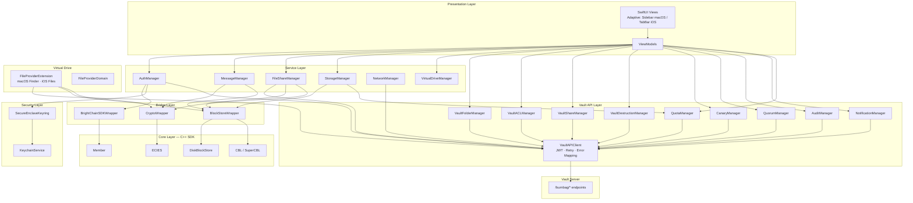
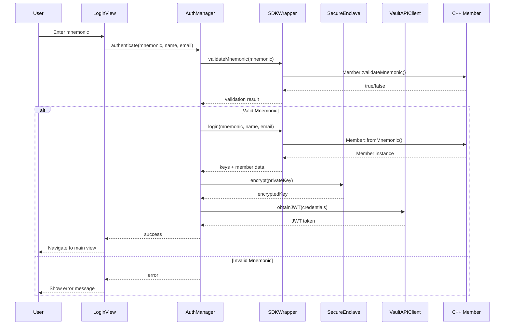
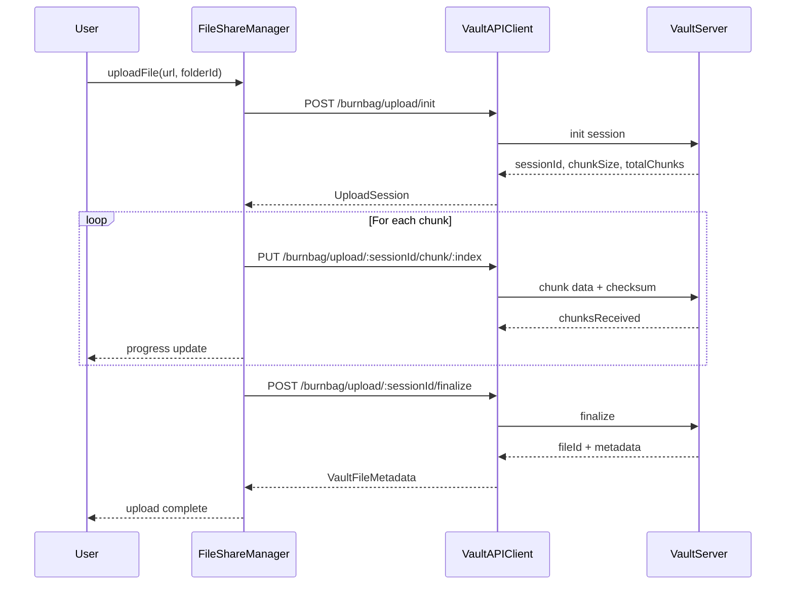

# Design Document: BrightChain Apple Client

## Overview

The BrightChain Apple Client is a universal SwiftUI application targeting macOS, iOS, and Mac Catalyst that provides a comprehensive interface to the BrightChain distributed storage and encrypted communication system. The application integrates:

1. A local C++ BrightChain SDK (via Objective-C++ bridge) for cryptographic operations and block storage
2. The DigitalBurnbag Vault HTTP API (`/burnbag/*`) as the server-side backend for file operations, folder management, access control, sharing, destruction, canary protocols, quorum governance, audit logging, and notifications

The architecture follows a layered approach:
1. **Presentation Layer**: SwiftUI views with MVVM pattern, adaptive layouts for iOS/macOS
2. **Service Layer**: Swift services coordinating business logic
3. **Vault API Layer**: Pure Swift HTTP client for all Vault API communication (no C++ bridge needed)
4. **Bridge Layer**: Objective-C++ wrappers exposing C++ SDK functionality
5. **Core Layer**: C++ BrightChain SDK (member management, block storage, cryptography)

Key design decisions:
- Use Secure Enclave for hardware-backed private key protection (Touch ID on Mac, Face ID on iPhone/iPad)
- Implement virtual drive using File Provider extension on both macOS (Finder) and iOS (Files app)
- Hybrid storage: local BlockStore for blocks/CBLs + server Vault for file management, folders, ACLs, sharing, destruction
- Vault API layer is pure Swift with `URLSession` — no Objective-C++ bridge required
- Support offline operation with sync-on-reconnect capability
- Shared Swift module for core business logic, models, and Vault_Client across all platforms
- Platform-appropriate navigation: sidebar on macOS, tab bar on iOS

## Architecture


```mermaid
graph TB
    subgraph "Presentation Layer"
        UI[SwiftUI Views<br/>Adaptive: Sidebar macOS / TabBar iOS]
        VM[ViewModels]
    end

    subgraph "Service Layer"
        AM[AuthManager]
        MM[MessageManager]
        FM[FileShareManager]
        SM[StorageManager]
        NM[NetworkManager]
        VDM[VirtualDriveManager]
    end

    subgraph "Vault API Layer"
        VC[VaultAPIClient<br/>JWT · Retry · Error Mapping]
        VFM[VaultFolderManager]
        VACL[VaultACLManager]
        VSM[VaultShareManager]
        VDest[VaultDestructionManager]
        VCan[CanaryManager]
        VQ[QuorumManager]
        VAud[AuditManager]
        VNot[NotificationManager]
        VQuota[QuotaManager]
    end

    subgraph "Bridge Layer"
        SDKWrapper[BrightChainSDKWrapper]
        BlockWrapper[BlockStoreWrapper]
        CryptoWrapper[CryptoWrapper]
    end

    subgraph "Security Layer"
        SEK[SecureEnclaveKeyring]
        KC[KeychainService]
    end

    subgraph "Core Layer — C++ SDK"
        Member[Member]
        DBS[DiskBlockStore]
        ECIES[ECIES]
        CBL[CBL / SuperCBL]
    end

    subgraph "Virtual Drive"
        FP[FileProviderExtension<br/>macOS Finder · iOS Files]
        FPD[FileProviderDomain]
    end

    subgraph "Vault Server"
        API["/burnbag/* endpoints"]
    end

    UI --> VM
    VM --> AM
    VM --> MM
    VM --> FM
    VM --> SM
    VM --> VDM
    VM --> VFM
    VM --> VACL
    VM --> VSM
    VM --> VDest
    VM --> VCan
    VM --> VQ
    VM --> VAud
    VM --> VNot
    VM --> VQuota

    AM --> SDKWrapper
    AM --> SEK
    AM --> VC
    MM --> CryptoWrapper
    MM --> BlockWrapper
    FM --> VC
    FM --> BlockWrapper
    FM --> CryptoWrapper
    SM --> BlockWrapper
    SM --> VQuota
    NM --> VC

    VFM --> VC
    VACL --> VC
    VSM --> VC
    VDest --> VC
    VCan --> VC
    VQ --> VC
    VAud --> VC
    VNot --> VC
    VQuota --> VC

    VC --> API

    SDKWrapper --> Member
    BlockWrapper --> DBS
    CryptoWrapper --> ECIES
    BlockWrapper --> CBL

    FP --> VC
    FP --> BlockWrapper
    FP --> CryptoWrapper

    SEK --> KC
```


### Component Interaction Flow — Authentication with JWT


```mermaid
sequenceDiagram
    participant User
    participant LoginView
    participant AuthManager
    participant SDKWrapper
    participant SecureEnclave
    participant VaultAPIClient
    participant Member as C++ Member

    User->>LoginView: Enter mnemonic
    LoginView->>AuthManager: authenticate(mnemonic, name, email)
    AuthManager->>SDKWrapper: validateMnemonic(mnemonic)
    SDKWrapper->>Member: Member::validateMnemonic()
    Member-->>SDKWrapper: true/false
    SDKWrapper-->>AuthManager: validation result

    alt Valid Mnemonic
        AuthManager->>SDKWrapper: login(mnemonic, name, email)
        SDKWrapper->>Member: Member::fromMnemonic()
        Member-->>SDKWrapper: Member instance
        SDKWrapper-->>AuthManager: keys + member data
        AuthManager->>SecureEnclave: encrypt(privateKey)
        SecureEnclave-->>AuthManager: encryptedKey
        AuthManager->>VaultAPIClient: obtainJWT(credentials)
        VaultAPIClient-->>AuthManager: JWT token
        AuthManager-->>LoginView: success
        LoginView-->>User: Navigate to main view
    else Invalid Mnemonic
        AuthManager-->>LoginView: error
        LoginView-->>User: Show error message
    end
```

### Component Interaction Flow — Chunked Upload via Vault API


```mermaid
sequenceDiagram
    participant User
    participant FileShareManager
    participant VaultAPIClient
    participant VaultServer

    User->>FileShareManager: uploadFile(url, folderId)
    FileShareManager->>VaultAPIClient: POST /burnbag/upload/init
    VaultAPIClient->>VaultServer: init session
    VaultServer-->>VaultAPIClient: sessionId, chunkSize, totalChunks
    VaultAPIClient-->>FileShareManager: UploadSession

    loop For each chunk
        FileShareManager->>VaultAPIClient: PUT /burnbag/upload/:sessionId/chunk/:index
        VaultAPIClient->>VaultServer: chunk data + checksum
        VaultServer-->>VaultAPIClient: chunksReceived
        FileShareManager-->>User: progress update
    end

    FileShareManager->>VaultAPIClient: POST /burnbag/upload/:sessionId/finalize
    VaultAPIClient->>VaultServer: finalize
    VaultServer-->>VaultAPIClient: fileId + metadata
    VaultAPIClient-->>FileShareManager: VaultFileMetadata
    FileShareManager-->>User: upload complete
```

## Components and Interfaces

### 1. Authentication Components

#### AuthManager
```swift
protocol AuthManagerProtocol {
    var currentMember: MemberModel? { get }
    var isAuthenticated: Bool { get }

    func register(name: String, email: String) async throws -> (member: MemberModel, mnemonic: String)
    func login(mnemonic: String, name: String, email: String) async throws -> MemberModel
    func logout() async
    func validateMnemonic(_ mnemonic: String) -> Bool
}

class AuthManager: ObservableObject, AuthManagerProtocol {
    @Published private(set) var currentMember: MemberModel?
    private let sdkWrapper: BrightChainSDKWrapper
    private let keyring: SecureEnclaveKeyring
    private let keychain: KeychainService
    private let vaultClient: VaultAPIClient  // obtains and manages JWT
}
```

#### SecureEnclaveKeyring (Enhanced)
```swift
protocol KeyringProtocol {
    func encrypt(data: Data) throws -> Data
    func decrypt(encryptedData: Data) throws -> Data
    func deleteKey() throws
    func hasKey() -> Bool
}

class SecureEnclaveKeyring: KeyringProtocol {
    private let tag: String
    private let accessControl: SecAccessControl

    func getOrCreateEnclaveKey() throws -> SecKey
    func encrypt(data: Data) throws -> Data   // ECIES with enclave key
    func decrypt(encryptedData: Data) throws -> Data
    func deleteKey() throws
}
```

### 2. Messaging Components

#### MessageManager
```swift
protocol MessageManagerProtocol {
    var conversations: [Conversation] { get }

    func loadConversations() async throws
    func createConversation(with recipients: [MemberId]) async throws -> Conversation
    func sendMessage(to conversation: Conversation, content: MessageContent) async throws -> Message
    func loadMessages(for conversation: Conversation, limit: Int, before: Date?) async throws -> [Message]
    func deleteConversation(_ conversation: Conversation) async throws
}

class MessageManager: ObservableObject, MessageManagerProtocol {
    @Published private(set) var conversations: [Conversation] = []
    private let blockStore: BlockStoreService
    private let cryptoService: CryptoService
    private let authManager: AuthManager
}
```

#### CryptoService
```swift
protocol CryptoServiceProtocol {
    func encrypt(data: Data, for recipients: [Data]) throws -> Data
    func decrypt(data: Data, with privateKey: Data) throws -> Data
    func sign(data: Data, with privateKey: Data) throws -> Data
    func verify(signature: Data, for data: Data, with publicKey: Data) -> Bool
}

class CryptoService: CryptoServiceProtocol {
    private let wrapper: CryptoWrapper
}
```

### 3. Vault API Layer Components

#### VaultAPIClient — Core HTTP Client (Req 16)
```swift
protocol VaultAPIClientProtocol {
    func request<T: Decodable>(_ endpoint: VaultEndpoint) async throws -> T
    func requestData(_ endpoint: VaultEndpoint) async throws -> Data
    func upload(data: Data, to endpoint: VaultEndpoint, headers: [String: String]) async throws -> Data
}

class VaultAPIClient: VaultAPIClientProtocol {
    private let session: URLSession
    private var jwt: String?
    private var jwtExpiry: Date?
    private let baseURL: URL
    private let timeout: TimeInterval

    /// Attaches JWT Bearer header to every authenticated request (Req 16.1)
    /// Refreshes JWT on 401 before retrying (Req 16.2)
    /// Maps HTTP errors to typed VaultAPIError (Req 16.3)
    /// Retries non-destructive requests with exponential backoff up to 3 times (Req 16.4)
    /// Serializes/deserializes JSON (Req 16.5)
    /// Validates hex ID format before sending (Req 16.6)
    /// Configurable base URL and timeout from AppSettings (Req 16.7)
}

enum VaultAPIError: Error {
    case badRequest(message: String)
    case unauthorized(message: String)
    case forbidden(message: String)
    case notFound(message: String)
    case conflict(message: String)
    case gone(message: String)
    case quotaExceeded(message: String)
    case unprocessable(message: String)
    case networkError(underlying: Error)
    case invalidIDFormat(field: String, value: String)
    case decodingError(underlying: Error)
}
```

#### VaultFolderManager (Req 17)
```swift
protocol VaultFolderManagerProtocol {
    func getRootFolder() async throws -> FolderContents
    func getFolderContents(id: String, sortField: SortField?, sortDirection: SortDirection?) async throws -> FolderContents
    func createFolder(name: String, parentFolderId: String) async throws -> VaultFolder
    func getBreadcrumbPath(folderId: String) async throws -> [BreadcrumbItem]
    func moveItem(id: String, itemType: ItemType, newParentId: String) async throws
}

class VaultFolderManager: ObservableObject, VaultFolderManagerProtocol {
    private let client: VaultAPIClient
}
```

#### VaultACLManager (Req 18)
```swift
protocol VaultACLManagerProtocol {
    func getACL(targetType: ACLTargetType, targetId: String) async throws -> ACLDocument
    func setACL(targetType: ACLTargetType, targetId: String, entries: [ACLEntry]) async throws
    func getEffectivePermissions(targetType: ACLTargetType, targetId: String, principalId: String) async throws -> EffectivePermissions
    func createPermissionSet(name: String, flags: [PermissionFlag], organizationId: String?) async throws -> PermissionSet
    func listPermissionSets(organizationId: String?) async throws -> [PermissionSet]
}

class VaultACLManager: ObservableObject, VaultACLManagerProtocol {
    private let client: VaultAPIClient
}
```

#### VaultShareManager (Req 19)
```swift
protocol VaultShareManagerProtocol {
    func shareInternal(fileId: String, recipientId: String, permissionLevel: String?) async throws
    func createShareLink(fileId: String, mode: ShareLinkMode, password: String?, expiresAt: Date?, maxAccessCount: Int?, recipientPublicKey: String?) async throws -> ShareLink
    func getSharedWithMe() async throws -> [SharedFile]
    func revokeShareLink(id: String) async throws
    func getMagnetURL(fileId: String) async throws -> String
    func getShareAudit(fileId: String) async throws -> [ShareAuditEntry]
}

class VaultShareManager: ObservableObject, VaultShareManagerProtocol {
    private let client: VaultAPIClient
}
```

#### VaultDestructionManager (Req 20)
```swift
protocol VaultDestructionManagerProtocol {
    func destroyImmediately(fileId: String) async throws -> DestructionResult
    func scheduleDestruction(fileId: String, at date: Date) async throws
    func cancelScheduledDestruction(fileId: String) async throws
    func destroyBatch(fileIds: [String]) async throws -> BatchDestructionResult
    func verifyProof(fileId: String, proof: DestructionProof, bundle: VerificationBundle) async throws -> ProofVerification
}

class VaultDestructionManager: ObservableObject, VaultDestructionManagerProtocol {
    private let client: VaultAPIClient
}
```

#### CanaryManager (Req 21)
```swift
protocol CanaryManagerProtocol {
    func listBindings() async throws -> [CanaryBinding]
    func listRecipientLists() async throws -> [RecipientList]
    func createBinding(_ binding: CreateCanaryBindingRequest) async throws -> CanaryBinding
    func createRecipientList(name: String, recipients: [Recipient]) async throws -> RecipientList
    func dryRun(bindingId: String) async throws -> DryRunResult
    func updateBinding(id: String, changes: UpdateCanaryBindingRequest) async throws -> CanaryBinding
    func deleteBinding(id: String) async throws
    func updateRecipientList(id: String, name: String?, recipients: [Recipient]?) async throws -> RecipientList
}

class CanaryManager: ObservableObject, CanaryManagerProtocol {
    private let client: VaultAPIClient
}
```

#### QuorumManager (Req 22)

Quorum is an independent BrightChain service with its own `/quorum/*` namespace. It is not part of the burnbag API — burnbag operations (destruction, sharing, ACL changes) trigger quorum workflows when targets are quorum-governed. The QuorumManager shares the same HTTP client and JWT auth as the Vault API layer.

```swift
protocol QuorumManagerProtocol {
    func submitRequest(operationType: QuorumOperationType, targetId: String, targetType: String, reason: String?) async throws -> QuorumRequest
    func approve(requestId: String, signature: Data) async throws -> QuorumApprovalResult
    func reject(requestId: String, reason: String?) async throws -> QuorumRejectionResult
}

class QuorumManager: ObservableObject, QuorumManagerProtocol {
    private let client: VaultAPIClient  // shared HTTP client, endpoints under /quorum/*
    private let cryptoService: CryptoService  // for ECDSA signing
}
```

#### AuditManager (Req 23)
```swift
protocol AuditManagerProtocol {
    func queryAuditLog(filters: AuditFilters) async throws -> [AuditEntry]
    func exportAuditLog(filters: AuditFilters) async throws -> [AuditEntry]
    func generateComplianceReport(request: ComplianceReportRequest) async throws -> ComplianceReport
}

class AuditManager: ObservableObject, AuditManagerProtocol {
    private let client: VaultAPIClient
}
```

#### NotificationManager (Req 24)
```swift
protocol NotificationManagerProtocol {
    var unreadCount: Int { get }
    var notifications: [VaultNotification] { get }

    func pollNotifications() async throws
    func markAsRead(ids: [String]) async throws
}

class NotificationManager: ObservableObject, NotificationManagerProtocol {
    @Published private(set) var unreadCount: Int = 0
    @Published private(set) var notifications: [VaultNotification] = []
    private let client: VaultAPIClient
}
```

#### QuotaManager (Req 25)
```swift
protocol QuotaManagerProtocol {
    var currentQuota: QuotaInfo? { get }

    func fetchQuota() async throws -> QuotaInfo
}

class QuotaManager: ObservableObject, QuotaManagerProtocol {
    @Published private(set) var currentQuota: QuotaInfo?
    private let client: VaultAPIClient
}
```


### 4. File Sharing Components (Updated for Vault API)

#### FileShareManager
```swift
protocol FileShareManagerProtocol {
    /// Upload via Vault chunked upload API (Req 6)
    func uploadFile(at url: URL, to folderId: String?, progress: @escaping (Double) -> Void) async throws -> VaultFileMetadata
    /// Download via Vault file endpoint (Req 7)
    func downloadFile(fileId: String, to destination: URL, progress: @escaping (Double) -> Void) async throws
    /// Download specific version
    func downloadVersion(fileId: String, versionId: String, to destination: URL, progress: @escaping (Double) -> Void) async throws
    /// Search files via Vault API
    func searchFiles(filters: FileSearchFilters) async throws -> FileSearchResult
    /// Get file metadata
    func getFileMetadata(fileId: String) async throws -> VaultFileMetadata
    /// Soft-delete
    func softDelete(fileId: String) async throws
    /// Restore soft-deleted
    func restore(fileId: String) async throws
    /// Get non-access proof
    func getNonAccessProof(fileId: String) async throws -> NonAccessProof
    /// Resume interrupted upload
    func resumeUpload(sessionId: String, progress: @escaping (Double) -> Void) async throws -> VaultFileMetadata

    // Legacy local operations
    func parseReference(from string: String) throws -> FileReference
    func generateMagnetURL(for reference: FileReference) -> String
    func getMissingBlocks(for reference: FileReference) -> [String]
}

class FileShareManager: ObservableObject, FileShareManagerProtocol {
    private let vaultClient: VaultAPIClient
    private let blockStore: BlockStoreService
    private let cryptoService: CryptoService
}
```

### 5. Storage Components

#### BlockStoreService
```swift
protocol BlockStoreServiceProtocol {
    func store(data: Data, size: BlockSize) throws -> Checksum
    func retrieve(checksum: Checksum) throws -> Data
    func exists(checksum: Checksum) -> Bool
    func delete(checksum: Checksum) throws -> Bool
    func getStorageStats() -> StorageStats
    func cleanup(policy: CleanupPolicy) async throws -> CleanupResult
}

class BlockStoreService: ObservableObject, BlockStoreServiceProtocol {
    private let wrapper: BlockStoreWrapper
    private let storePath: URL
    @Published private(set) var stats: StorageStats
}
```

#### StorageManager (Updated for server quota — Req 8, 25)
```swift
protocol StorageManagerProtocol {
    var storageStats: StorageStats { get }
    var storageLimit: UInt64 { get set }
    var serverQuota: QuotaInfo? { get }

    func getUsageByCategory() -> [StorageCategory: UInt64]
    func setStorageLimit(_ limit: UInt64) throws
    func performCleanup() async throws -> CleanupResult
    func verifyIntegrity() async throws -> IntegrityReport
    func refreshServerQuota() async throws -> QuotaInfo
}

class StorageManager: ObservableObject, StorageManagerProtocol {
    private let blockStore: BlockStoreService
    private let quotaManager: QuotaManager
}
```

### 6. Virtual Drive Components (Updated for Vault + File Provider)

#### VirtualDriveManager
```swift
protocol VirtualDriveManagerProtocol {
    var isMounted: Bool { get }
    var mountPoint: URL { get }
    var availableContent: [VirtualFileEntry] { get }

    func mount(at path: URL) async throws
    func unmount() async throws
    func importReference(_ reference: FileReference) async throws
    func removeContent(_ entry: VirtualFileEntry) async throws
}

/// Now backed by Vault folder hierarchy + local CBL catalog
class VirtualDriveManager: ObservableObject, VirtualDriveManagerProtocol {
    @Published private(set) var isMounted: Bool = false
    @Published private(set) var availableContent: [VirtualFileEntry] = []

    private let fileProvider: FileProviderService
    private let blockStore: BlockStoreService
    private let catalog: ContentCatalog
    private let vaultFolderManager: VaultFolderManager  // server folder hierarchy
}
```

#### FileProviderExtension (macOS Finder + iOS Files app)
```swift
// Separate File Provider extension target — shared across macOS and iOS
class BrightChainFileProviderExtension: NSFileProviderExtension {
    func item(for identifier: NSFileProviderItemIdentifier) throws -> NSFileProviderItem
    func urlForItem(withPersistentIdentifier identifier: NSFileProviderItemIdentifier) -> URL?
    func providePlaceholder(at url: URL) throws
    func startProvidingItem(at url: URL) throws  // downloads via Vault API or local BlockStore
    func stopProvidingItem(at url: URL)
}
```

### 7. Network Components (Updated for Vault API reachability)

#### NetworkManager
```swift
protocol NetworkManagerProtocol {
    var connectionStatus: ConnectionStatus { get }
    var connectedPeers: [PeerInfo] { get }
    var vaultAPIReachable: Bool { get }

    func connect() async throws
    func disconnect() async
    func requestBlock(checksum: Checksum) async throws -> Data
    func announceBlock(checksum: Checksum) async
    func syncPendingOperations() async throws
    func checkVaultAPIReachability() async -> Bool
}

class NetworkManager: ObservableObject, NetworkManagerProtocol {
    @Published private(set) var connectionStatus: ConnectionStatus = .disconnected
    @Published private(set) var connectedPeers: [PeerInfo] = []
    @Published private(set) var vaultAPIReachable: Bool = false

    private var pendingOperations: [PendingOperation] = []
    private let endpoints: [NetworkEndpoint]
    private let vaultClient: VaultAPIClient
}
```

### 8. SDK Bridge Components

#### BrightChainSDKWrapper
```objc
@interface BrightChainSDKWrapper : NSObject

// Member operations
- (BOOL)validateMnemonic:(NSString *)mnemonic;
- (NSString *)generateMnemonic;
- (NSDictionary *)loginWithMnemonic:(NSString *)mnemonic name:(NSString *)name email:(NSString *)email;
- (NSDictionary *)createMemberWithMnemonic:(NSString *)mnemonic name:(NSString *)name email:(NSString *)email;

// Signing operations
- (NSData *)signData:(NSData *)data withPrivateKey:(NSData *)privateKey;
- (BOOL)verifySignature:(NSData *)signature forData:(NSData *)data withPublicKey:(NSData *)publicKey;

@end
```

#### BlockStoreWrapper
```objc
@interface BlockStoreWrapper : NSObject

- (instancetype)initWithStorePath:(NSString *)path blockSize:(NSInteger)blockSize;
- (NSString *)storeBlock:(NSData *)data;
- (NSString *)storeBlock:(NSData *)data withMetadata:(NSDictionary *)metadata;
- (NSData *)getBlock:(NSString *)checksum;
- (BOOL)hasBlock:(NSString *)checksum;
- (BOOL)deleteBlock:(NSString *)checksum;
- (NSDictionary *)getMetadata:(NSString *)checksum;
- (NSDictionary *)getStats;

@end
```

#### CryptoWrapper
```objc
@interface CryptoWrapper : NSObject

- (NSData *)encryptData:(NSData *)data forRecipient:(NSData *)publicKey;
- (NSData *)encryptData:(NSData *)data forRecipients:(NSArray<NSData *> *)publicKeys;
- (NSData *)decryptData:(NSData *)data withPrivateKey:(NSData *)privateKey;

- (NSDictionary *)createCBL:(NSArray<NSString *> *)checksums
                  creatorId:(NSData *)creatorId
                 privateKey:(NSData *)privateKey
           originalChecksum:(NSString *)originalChecksum
         originalDataLength:(uint64_t)length;

- (NSDictionary *)parseCBL:(NSData *)cblData;
- (NSArray<NSString *> *)getCBLAddresses:(NSData *)cblData;

@end
```


## Data Models

### Member and Authentication

```swift
struct MemberModel: Identifiable, Codable {
    let id: UUID
    let memberId: Data  // 16-byte BrightChain member ID
    let name: String
    let email: String
    let memberType: MemberType
    let publicKey: Data
    let dateCreated: Date
    var dateUpdated: Date

    enum MemberType: String, Codable {
        case admin, system, user, anonymous
    }
}

struct SessionState: Codable {
    let memberId: Data
    let encryptedPrivateKey: Data
    let loginTime: Date
    var lastActivity: Date
    var jwt: String?          // Vault API JWT
    var jwtExpiry: Date?      // JWT expiration
}
```

### Messaging

```swift
struct Conversation: Identifiable, Codable {
    let id: UUID
    let participants: [Data]
    let createdAt: Date
    var lastMessageAt: Date?
    var lastMessagePreview: String?
    var unreadCount: Int
}

struct Message: Identifiable, Codable {
    let id: UUID
    let conversationId: UUID
    let senderId: Data
    let timestamp: Date
    let content: MessageContent
    let cblChecksum: String
    var status: MessageStatus

    enum MessageStatus: String, Codable {
        case sending, sent, delivered, read, failed
    }
}

struct MessageContent: Codable {
    let text: String?
    let attachments: [AttachmentReference]?
}

struct AttachmentReference: Codable {
    let filename: String
    let mimeType: String
    let size: UInt64
    let cblChecksum: String
}
```

### File Sharing (Local)

```swift
struct FileReference: Codable {
    let type: ReferenceType
    let checksum: String
    let filename: String
    let mimeType: String
    let size: UInt64
    let createdAt: Date
    let creatorId: Data?

    enum ReferenceType: String, Codable {
        case cbl, superCBL, magnetURL
    }
}

struct CBLReference: Codable {
    let checksum: String
    let blockChecksums: [String]
    let originalChecksum: String
    let originalSize: UInt64
    let tupleSize: Int
    let signature: Data
}

struct SuperCBLReference: Codable {
    let checksum: String
    let subCBLChecksums: [String]
    let totalBlockCount: Int
    let depth: Int
    let originalChecksum: String
    let originalSize: UInt64
    let signature: Data
}

struct MagnetURL {
    let infoHash: String
    let displayName: String?
    let size: UInt64?
    let checksums: [String]

    func toString() -> String
    static func parse(_ urlString: String) throws -> MagnetURL
}
```

### Vault API Models

```swift
// --- File Metadata (from Vault API responses) ---

struct VaultFileMetadata: Codable, Identifiable {
    let id: String              // hex
    let name: String
    let ownerId: String         // hex
    let folderId: String        // hex
    let fileName: String
    let mimeType: String
    let sizeBytes: UInt64
    let description: String?
    let tags: [String]
    let currentVersionId: String  // hex
    let vaultCreationLedgerEntryHash: String?
    let aclId: String?
    let deletedAt: Date?
    let scheduledDestructionAt: Date?
    let quorumGoverned: Bool
    let visibleWatermark: Bool
    let invisibleWatermark: Bool
    let createdAt: Date
    let updatedAt: Date
    let modifiedAt: Date?
    let createdBy: String?
    let updatedBy: String?
}

struct FileVersion: Codable, Identifiable {
    var id: String { versionId }
    let versionId: String
    let versionNumber: Int
    let sizeBytes: UInt64
    let createdAt: Date
    let createdBy: String
    let isCurrent: Bool
}

struct FileSearchResult: Codable {
    let results: [VaultFileMetadata]
    let total: Int
}

struct FileSearchFilters {
    var query: String?
    var tags: [String]?
    var mimeType: String?
    var folderId: String?
    var dateFrom: Date?
    var dateTo: Date?
    var sizeMin: UInt64?
    var sizeMax: UInt64?
    var deleted: Bool?
}

// --- Upload Session ---

struct UploadSession: Codable {
    let sessionId: String
    let chunkSize: Int
    let totalChunks: Int
}

struct UploadChunkResult: Codable {
    let chunkIndex: Int
    let chunksReceived: Int
    let totalChunks: Int
}

struct UploadSessionStatus: Codable {
    let sessionId: String
    let status: String
    let chunksReceived: Int
    let totalChunks: Int
    let fileName: String
    let totalSizeBytes: UInt64
}

// --- Folders ---

struct VaultFolder: Codable, Identifiable {
    let id: String
    let name: String
    let ownerId: String
    let parentFolderId: String?
    let quorumGoverned: Bool
    let createdAt: Date
    let updatedAt: Date
}

struct FolderContents: Codable {
    let folder: VaultFolder
    let files: [VaultFileMetadata]
    let subfolders: [VaultFolder]
}

struct BreadcrumbItem: Codable, Identifiable {
    let id: String
    let name: String
}

enum SortField: String, Codable {
    case name, size, modifiedDate, type
}

enum SortDirection: String, Codable {
    case asc, desc
}

enum ItemType: String, Codable {
    case file, folder
}

// --- ACL ---

enum PermissionFlag: String, Codable, CaseIterable {
    case read, write, delete, share, admin, preview, comment, download, manage_versions
}

enum PermissionLevel: String, Codable {
    case viewer, commenter, editor, owner
}

struct ACLEntry: Codable {
    let principalId: String
    let level: PermissionLevel?
    let flags: [PermissionFlag]?
    let customPermissionSetId: String?
}

struct ACLDocument: Codable {
    let entries: [ACLEntry]
}

struct EffectivePermissions: Codable {
    let flags: [PermissionFlag]
    let level: PermissionLevel?
    let inherited: Bool
    let source: String?
}

struct PermissionSet: Codable, Identifiable {
    let id: String
    let name: String
    let flags: [PermissionFlag]
    let organizationId: String?
    let createdBy: String
}

enum ACLTargetType: String, Codable {
    case file, folder
}

// --- Sharing ---

enum ShareLinkMode: String, Codable {
    case server_proxied, ephemeral_key_pair, recipient_public_key
}

struct ShareLink: Codable {
    let token: String
    let url: String
    let mode: ShareLinkMode
    let expiresAt: Date?
    let maxAccessCount: Int?
    let accessCount: Int
}

struct SharedFile: Codable {
    let fileId: String
    let fileName: String
    let sharedBy: String
    let permissionLevel: String
    let sharedAt: Date
}

struct ShareAuditEntry: Codable {
    let action: String
    let token: String?
    let recipientId: String?
    let permissionLevel: String?
    let ipAddress: String?
    let timestamp: Date
}

// --- Destruction ---

struct DestructionProof: Codable {
    let merkleRoot: String
    let bloomWitness: String
    let timestamp: Date
}

struct VerificationBundle: Codable {
    let ledgerEntryHash: String
    let blockHeight: Int
    let chainId: String
}

struct DestructionResult: Codable {
    let destroyed: Bool
    let proof: DestructionProof
    let verificationBundle: VerificationBundle
}

struct BatchDestructionResult: Codable {
    let results: [BatchDestructionItem]
}

struct BatchDestructionItem: Codable {
    let fileId: String
    let destroyed: Bool
    let proof: DestructionProof?
    let error: String?
}

struct ProofVerification: Codable {
    let valid: Bool
    let verifiedAt: Date
    let ledgerConfirmed: Bool
}

// --- Non-Access Proof ---

struct NonAccessProof: Codable {
    let proof: NonAccessProofData
    let verificationBundle: VerificationBundle
}

struct NonAccessProofData: Codable {
    let bloomWitness: String
    let merkleRoot: String
    let merkleProof: [String]
    let timestamp: Date
}

// --- Canary ---

struct CanaryBinding: Codable, Identifiable {
    let id: String
    let protocolId: String
    let protocolAction: String
    let canaryCondition: String   // presence | duress | absense
    let canaryProvider: String
    let fileIds: [String]
    let folderIds: [String]
    let recipientListId: String?
    let cascadeBindingIds: [String]
    let enabled: Bool
    let timeoutMs: Int?
    let lastSignalAt: Date?
    let createdBy: String
    let createdAt: Date
    let updatedAt: Date
}

struct CreateCanaryBindingRequest: Codable {
    let protocolAction: String
    let canaryCondition: String
    let canaryProvider: String
    let fileIds: [String]?
    let folderIds: [String]?
    let recipientListId: String?
    let timeoutMs: Int?
    let cascadeDelayMs: [Int]?
}

struct UpdateCanaryBindingRequest: Codable {
    let enabled: Bool?
    let timeoutMs: Int?
    let protocolAction: String?
    let canaryCondition: String?
    let canaryProvider: String?
}

struct RecipientList: Codable, Identifiable {
    let id: String
    let name: String
    let ownerId: String
    let recipients: [Recipient]
    let createdAt: Date
    let updatedAt: Date
}

struct Recipient: Codable {
    let name: String
    let email: String
    let publicKey: String?
}

struct DryRunResult: Codable {
    let bindingId: String
    let filesAffected: [String]
    let foldersAffected: [String]
    let affectedFileCount: Int
    let recipientCount: Int
    let actionsDescription: [String]
}

// --- Quorum ---

enum QuorumOperationType: String, Codable {
    case destruction, external_share, bulk_delete, acl_change
}

struct QuorumRequest: Codable, Identifiable {
    var id: String { requestId }
    let requestId: String
    let operationType: String
    let targetId: String
    let status: String          // pending | approved | rejected
    let requiredApprovals: Int
    let currentApprovals: Int
    let currentRejections: Int
    let createdAt: Date
    let expiresAt: Date
}

struct QuorumApprovalResult: Codable {
    let requestId: String
    let status: String
    let currentApprovals: Int
    let requiredApprovals: Int
    let executed: Bool
    let executionResult: QuorumExecutionResult?
}

struct QuorumExecutionResult: Codable {
    let destroyed: Bool?
    let proof: DestructionProof?
}

struct QuorumRejectionResult: Codable {
    let requestId: String
    let status: String
    let currentApprovals: Int
    let currentRejections: Int
    let requiredApprovals: Int
}

// --- Audit ---

struct AuditEntry: Codable, Identifiable {
    let id: String
    let actorId: String
    let targetId: String
    let operationType: String
    let details: AuditDetails?
    let ledgerEntryHash: String
    let timestamp: Date
}

struct AuditDetails: Codable {
    let ipAddress: String?
    let userAgent: String?
}

struct AuditFilters {
    var actorId: String?
    var targetId: String?
    var operationType: String?
    var dateFrom: Date?
    var dateTo: Date?
    var page: Int?
    var pageSize: Int?
}

struct ComplianceReportRequest: Codable {
    let dateFrom: Date
    let dateTo: Date
    let includeAccessPatterns: Bool?
    let includeDestructionEvents: Bool?
    let includeSharingActivity: Bool?
    let includeNonAccessProofs: Bool?
}

struct ComplianceReport: Codable {
    let period: ReportPeriod
    let summary: ReportSummary
    let accessPatterns: AccessPatterns?
    let destructionEvents: DestructionEvents?
    let sharingActivity: SharingActivity?
    let nonAccessProofs: NonAccessProofsSummary?
}

struct ReportPeriod: Codable { let from: Date; let to: Date }
struct ReportSummary: Codable { let totalOperations: Int; let uniqueActors: Int; let uniqueTargets: Int }
struct AccessPatterns: Codable { let totalAccesses: Int; let uniqueFiles: Int; let peakHour: Int }
struct DestructionEvents: Codable { let totalDestructions: Int; let scheduledDestructions: Int; let immediateDestructions: Int; let allProofsValid: Bool }
struct SharingActivity: Codable { let internalShares: Int; let externalLinks: Int; let revokedLinks: Int }
struct NonAccessProofsSummary: Codable { let totalProofs: Int; let allValid: Bool }

// --- Notifications ---

struct VaultNotification: Codable, Identifiable {
    let id: String
    let type: String            // quorum_request | share_received | canary_alert | ...
    let title: String
    let message: String
    let targetId: String?
    let targetType: String?
    let createdAt: Date
    let read: Bool
}

// --- Quota ---

struct QuotaInfo: Codable {
    let usedBytes: UInt64
    let quotaBytes: UInt64
    let breakdown: [QuotaBreakdownItem]

    var usagePercentage: Double {
        guard quotaBytes > 0 else { return 0 }
        return Double(usedBytes) / Double(quotaBytes) * 100
    }
}

struct QuotaBreakdownItem: Codable {
    let category: String
    let usedBytes: UInt64
}

// --- TCBL Export ---

struct TCBLExportRequest: Codable {
    let mimeTypeFilters: [String]?
    let maxDepth: Int?
    let excludePatterns: [String]?
}

struct TCBLExportResult: Codable {
    let format: String
    let folderName: String
    let totalFiles: Int
    let totalSizeBytes: UInt64
    let data: String
    let skippedFiles: [SkippedFile]?
}

struct SkippedFile: Codable {
    let fileId: String
    let reason: String
}
```

### Storage (Local)

```swift
struct StorageStats: Codable {
    let totalUsed: UInt64
    let totalAvailable: UInt64
    let blockCounts: [BlockSize: Int]
    let categoryUsage: [StorageCategory: UInt64]
}

enum StorageCategory: String, Codable {
    case messages, files, system, cache
}

enum BlockSize: Int, Codable {
    case message = 512
    case tiny = 1024
    case small = 4096
    case medium = 1048576
    case large = 67108864
    case huge = 268435456
}

struct CleanupPolicy: Codable {
    let maxAge: TimeInterval?
    let maxSize: UInt64?
    let preserveCategories: [StorageCategory]
    let orphanedBlocksOnly: Bool
}

struct CleanupResult: Codable {
    let blocksRemoved: Int
    let bytesFreed: UInt64
    let errors: [String]
}

struct IntegrityReport: Codable {
    let totalBlocks: Int
    let verifiedBlocks: Int
    let corruptedBlocks: [String]
    let missingBlocks: [String]
}
```

### Virtual Drive

```swift
struct VirtualFileEntry: Identifiable, Codable {
    let id: UUID
    let filename: String
    let mimeType: String
    let size: UInt64
    let reference: FileReference
    let addedAt: Date
    var isAvailable: Bool
    var missingBlocks: [String]?
}

struct ContentCatalog: Codable {
    var entries: [VirtualFileEntry]
    var lastUpdated: Date

    mutating func add(_ entry: VirtualFileEntry)
    mutating func remove(id: UUID)
    func find(checksum: String) -> VirtualFileEntry?
}
```

### Network

```swift
enum ConnectionStatus: String, Codable {
    case disconnected, connecting, connected, error
}

struct PeerInfo: Identifiable, Codable {
    let id: String
    let endpoint: String
    let connectedAt: Date
    var lastActivity: Date
    var blocksExchanged: Int
}

struct NetworkEndpoint: Codable {
    let host: String
    let port: Int
    let isDefault: Bool
}

struct PendingOperation: Codable {
    let id: UUID
    let type: OperationType
    let data: Data
    let createdAt: Date
    var retryCount: Int

    enum OperationType: String, Codable {
        case blockRequest, blockAnnounce, messageSend
    }
}
```

### Settings

```swift
struct AppSettings: Codable {
    var storagePath: URL
    var storageLimit: UInt64
    var virtualDriveMountPoint: URL
    var virtualDriveEnabled: Bool
    var networkEndpoints: [NetworkEndpoint]
    var autoConnect: Bool
    var cacheSize: UInt64
    var logLevel: LogLevel
    var vaultAPIBaseURL: URL          // Vault API base URL (Req 16.7)
    var vaultAPITimeout: TimeInterval // Vault API timeout (Req 16.7)

    enum LogLevel: String, Codable {
        case debug, info, warning, error
    }

    static var `default`: AppSettings
}
```


## Correctness Properties

*A property is a characteristic or behavior that should hold true across all valid executions of a system—essentially, a formal statement about what the system should do. Properties serve as the bridge between human-readable specifications and machine-verifiable correctness guarantees.*

### Authentication Properties

**Property 1: Mnemonic Generation Validity**
*For any* registration request, the generated mnemonic SHALL be a valid BIP39 12-word mnemonic that passes checksum validation.
**Validates: Requirements 1.2**

**Property 2: Mnemonic Validation Correctness**
*For any* string input, the mnemonic validator SHALL return true if and only if the string is a valid BIP39 mnemonic with correct checksum.
**Validates: Requirements 2.2**

**Property 3: Key Derivation Determinism**
*For any* valid BIP39 mnemonic, deriving keys using BIP44 path m/44'/0'/0'/0/0 SHALL always produce identical secp256k1 key pairs.
**Validates: Requirements 1.4, 2.4**

**Property 4: Secure Enclave Encryption Round-Trip**
*For any* data encrypted using the Secure Enclave key, decrypting with the same enclave key SHALL return the original data unchanged.
**Validates: Requirements 1.5, 3.2**

### Messaging Properties

**Property 5: Conversation ID Uniqueness**
*For any* set of created conversations, all conversation identifiers SHALL be unique (no duplicates).
**Validates: Requirements 4.3**

**Property 6: Conversation Display Completeness**
*For any* conversation with messages, the display representation SHALL include the most recent message preview and timestamp.
**Validates: Requirements 4.4**

**Property 7: Conversation Deletion Block Preservation**
*For any* conversation deletion, all blocks referenced by the conversation's messages SHALL remain in the BlockStore after deletion.
**Validates: Requirements 4.6**

**Property 8: Message Encryption Round-Trip**
*For any* message encrypted for a set of recipients using ECIES, each recipient SHALL be able to decrypt the message to obtain the original content using their private key.
**Validates: Requirements 5.1, 5.4**

**Property 9: Message Storage Block Creation**
*For any* sent message, the BlockStore SHALL contain blocks representing the encrypted message content.
**Validates: Requirements 5.2**

**Property 10: CBL Block Reference Integrity**
*For any* CBL created for a message or file, the CBL SHALL contain references to all constituent blocks, and all referenced checksums SHALL correspond to existing blocks.
**Validates: Requirements 5.3, 6.4**

**Property 11: Message Display Completeness**
*For any* displayed message, the rendering SHALL include sender identity, timestamp, and decrypted content.
**Validates: Requirements 5.5**

**Property 12: Attachment Block Separation**
*For any* message with attachments, each attachment SHALL be stored as separate encrypted blocks with its own CBL reference.
**Validates: Requirements 5.7**

### File Sharing Properties

**Property 13: File Block Size Selection**
*For any* file being uploaded, the splitting algorithm SHALL produce blocks of valid BrightChain block sizes (512B, 1KB, 4KB, 1MB, 64MB, or 256MB) appropriate for the file size.
**Validates: Requirements 6.2**

**Property 14: Block Encryption for Recipients**
*For any* file block encrypted for a set of recipients, each recipient SHALL be able to decrypt the block using their private key.
**Validates: Requirements 6.3**

**Property 15: Reference Generation Parseability**
*For any* generated file reference (Magnet URL or CBL file), parsing the reference SHALL extract the correct checksums and metadata.
**Validates: Requirements 6.5**

**Property 16: Magnet URL Parse Round-Trip**
*For any* valid Magnet URL, parsing then regenerating the URL SHALL produce an equivalent reference containing the same checksums and metadata.
**Validates: Requirements 7.1**

**Property 17: CBL Parse Correctness**
*For any* valid CBL data, parsing SHALL extract the correct block checksums, original data length, and creator signature.
**Validates: Requirements 7.2**

**Property 18: File Split-Reassemble Round-Trip**
*For any* file, splitting into blocks, storing, retrieving, and reassembling SHALL produce a file identical to the original (same content and checksum).
**Validates: Requirements 7.5**

### Storage Properties

**Property 19: Storage Categorization Consistency**
*For any* storage statistics query, the sum of category-specific usage (messages, files, system, cache) SHALL equal the total storage used.
**Validates: Requirements 8.2**

**Property 20: Storage Limit Enforcement**
*For any* block storage attempt when storage usage equals or exceeds the configured limit, the operation SHALL be rejected.
**Validates: Requirements 8.3**

**Property 21: Orphan Cleanup Safety**
*For any* cleanup operation targeting orphaned blocks, only blocks not referenced by any CBL or SuperCBL SHALL be removed.
**Validates: Requirements 8.5**

**Property 22: CBL Reference Consistency After Deletion**
*For any* block deletion, no CBL in the system SHALL reference the deleted block's checksum.
**Validates: Requirements 8.6**

**Property 23: Block Integrity Verification**
*For any* block in the BlockStore, the stored checksum SHALL match the SHA3-512 hash computed from the block data.
**Validates: Requirements 8.7**

### Virtual Drive Properties

**Property 24: Virtual Drive File Listing Completeness**
*For any* mounted virtual drive, all files with valid and complete CBL references in the catalog SHALL appear in the file listing.
**Validates: Requirements 9.2**

**Property 25: Virtual Drive File Operations**
*For any* file in the virtual drive with all blocks available, standard file operations (read, stat) SHALL return correct data matching the original file.
**Validates: Requirements 9.7**

**Property 26: Content Import Catalog Addition**
*For any* successfully imported reference (Magnet URL, CBL, or SuperCBL), the content catalog SHALL contain an entry for the imported content.
**Validates: Requirements 10.1, 10.2, 10.3**

**Property 27: Metadata Preservation on Import**
*For any* imported content, the virtual drive entry SHALL display the original filename and metadata from the reference.
**Validates: Requirements 10.4**

**Property 28: Availability Status Accuracy**
*For any* file in the virtual drive, the availability status SHALL be "unavailable" if and only if one or more referenced blocks are not present in the local BlockStore.
**Validates: Requirements 10.5**

**Property 29: Catalog Completeness**
*For any* imported content reference, the content catalog SHALL maintain a persistent record of the import.
**Validates: Requirements 10.7**

### BlockStore Properties

**Property 30: BlockStore Directory Structure**
*For any* stored block, the block file SHALL be located at the path: `{storePath}/{blockSize}/{checksum[0:2]}/{checksum[2:4]}/{checksum}`.
**Validates: Requirements 11.1**

**Property 31: BlockStore Checksum Verification**
*For any* block stored and subsequently retrieved, the computed SHA3-512 checksum of the retrieved data SHALL match the original storage checksum.
**Validates: Requirements 11.2, 11.3**

**Property 32: BlockStore Block Size Support**
*For any* valid block size (Message, Tiny, Small, Medium, Large, Huge), the BlockStore SHALL successfully store and retrieve blocks of that size.
**Validates: Requirements 11.4**

**Property 33: BlockStore Metadata Creation**
*For any* block stored with metadata, a corresponding metadata file SHALL exist at `{blockPath}.m.json` containing the provided metadata.
**Validates: Requirements 11.5**

**Property 34: BlockStore Statistics Accuracy**
*For any* BlockStore, the reported statistics SHALL accurately reflect the count and total size of stored blocks by block size category.
**Validates: Requirements 11.7**

### Network Properties

**Property 35: Block Serving Policy Enforcement**
*For any* block request from a peer, the response SHALL comply with the configured sharing policy (serve if policy allows, reject otherwise).
**Validates: Requirements 12.4**

### Settings Properties

**Property 36: Settings Persistence Round-Trip**
*For any* settings configuration saved to storage, loading the settings SHALL return values identical to those that were saved.
**Validates: Requirements 13.7**

### Error Handling Properties

**Property 37: Failed Operation Queuing**
*For any* network operation that fails due to connectivity issues, the operation SHALL be added to the pending operations queue for retry.
**Validates: Requirements 14.4**

### Vault API Client Properties

**Property 38: JWT Header Attachment**
*For any* authenticated Vault API request, the VaultAPIClient SHALL include an `Authorization: Bearer <token>` header with a valid JWT token.
**Validates: Requirements 16.1**

**Property 39: HTTP Error Code to Typed Error Mapping**
*For any* Vault API HTTP error response with a status code in {400, 401, 403, 404, 409, 410, 413, 422} and a JSON body containing a `message` field, the VaultAPIClient SHALL produce the corresponding typed `VaultAPIError` variant with the server's message preserved.
**Validates: Requirements 16.3**

**Property 40: Vault API Model JSON Round-Trip**
*For any* valid Vault API request or response model conforming to `Codable`, encoding to JSON and decoding back SHALL produce an equivalent model with all fields preserved.
**Validates: Requirements 16.5**

**Property 41: Hex ID Format Validation**
*For any* string, the VaultAPIClient hex ID validator SHALL accept it if and only if it is exactly 32 hexadecimal characters (matching `^[0-9a-fA-F]{32}$`).
**Validates: Requirements 16.6**

**Property 42: Upload Chunk Checksum Integrity**
*For any* file data split into chunks for upload, the checksum computed for each chunk SHALL match the checksum recomputed from that chunk's raw bytes.
**Validates: Requirements 6.3**

### Permission and Routing Properties

**Property 43: Permission-Gated UI Control State**
*For any* set of effective permissions and any permission-gated UI action (ACL editing requires `admin`, sharing requires `share`, deletion requires `delete`, downloading requires `download`), the corresponding UI control SHALL be enabled if and only if the required permission flag is present in the effective permissions set.
**Validates: Requirements 18.7, 19.8**

**Property 44: Quorum Routing for Governed Targets**
*For any* sensitive operation (destruction, external sharing, bulk deletion, ACL change) on a target where `quorumGoverned` is `true`, the operation flow SHALL route through the Quorum approval workflow before executing the operation. For targets where `quorumGoverned` is `false`, the operation SHALL proceed directly.
**Validates: Requirements 20.7, 22.1**

### Canary Properties

**Property 45: Canary Provider Category Completeness**
*For any* supported canary provider, the provider SHALL belong to exactly one category, and the union of all category provider lists SHALL equal the complete set of supported providers.
**Validates: Requirements 21.3**

### Audit Properties

**Property 46: Audit Entry Display Completeness**
*For any* audit entry, the rendered display SHALL include the actor ID, target ID, operation type, ledger entry hash, and timestamp fields.
**Validates: Requirements 23.2**

### Notification Properties

**Property 47: Notification Type Navigation Routing**
*For any* notification with a known type (quorum_request, share_received, canary_alert, etc.), the notification center SHALL provide the correct navigation action corresponding to that type (quorum approval view, shared file view, canary settings view, respectively).
**Validates: Requirements 24.3, 24.4**

**Property 48: Unread Notification Count Accuracy**
*For any* list of notifications, the displayed unread count SHALL equal the number of notifications where `read` is `false`.
**Validates: Requirements 24.7**

### Quota Properties

**Property 49: Quota Usage Percentage Calculation**
*For any* `QuotaInfo` with `quotaBytes > 0`, the computed `usagePercentage` SHALL equal `(usedBytes / quotaBytes) * 100`. When `quotaBytes` is 0, `usagePercentage` SHALL be 0.
**Validates: Requirements 25.1**

**Property 50: Quota Warning Threshold**
*For any* `QuotaInfo`, the quota warning indicator SHALL be displayed if and only if `usagePercentage` exceeds 80%.
**Validates: Requirements 25.3**


## Error Handling

### Error Categories

1. **Authentication Errors**
   - Invalid mnemonic format or checksum
   - Key derivation failure
   - Secure Enclave unavailable
   - Biometric authentication failure (Face ID / Touch ID)
   - JWT obtainment failure
   - JWT refresh failure

2. **Vault API Errors** (mapped from HTTP status codes)
   - `400 Bad Request` → `VaultAPIError.badRequest` — validation failure, invalid ID format
   - `401 Unauthorized` → `VaultAPIError.unauthorized` — expired/invalid JWT (triggers refresh)
   - `403 Forbidden` → `VaultAPIError.forbidden` — insufficient permissions
   - `404 Not Found` → `VaultAPIError.notFound` — resource doesn't exist
   - `409 Conflict` → `VaultAPIError.conflict` — circular folder move, already destroyed
   - `410 Gone` → `VaultAPIError.gone` — expired quorum request, revoked share link
   - `413 Payload Too Large` → `VaultAPIError.quotaExceeded` — storage quota exceeded
   - `422 Unprocessable` → `VaultAPIError.unprocessable` — no exportable files

3. **Cryptographic Errors**
   - ECIES encryption/decryption failure
   - Signature verification failure
   - Key format errors
   - ECDSA signing failure (quorum approval)

4. **Storage Errors**
   - Disk full / local storage limit reached
   - Server quota exceeded
   - Block corruption detected
   - File system permission errors
   - Metadata parsing errors

5. **Network Errors**
   - Connection timeout
   - Peer unavailable
   - Vault API unreachable
   - Protocol errors
   - Block not found on network

6. **Virtual Drive Errors**
   - Mount failure (macOS Finder / iOS Files)
   - File Provider extension errors
   - Missing blocks for file access

### Error Handling Strategy

```swift
enum BrightChainError: Error {
    case authentication(AuthError)
    case vaultAPI(VaultAPIError)
    case cryptographic(CryptoError)
    case storage(StorageError)
    case network(NetworkError)
    case virtualDrive(VirtualDriveError)

    var isRecoverable: Bool
    var userMessage: String
    var technicalDetails: String
    var suggestedActions: [RecoveryAction]
}

enum RecoveryAction {
    case retry
    case refreshJWT
    case checkNetwork
    case freeStorage
    case upgradeQuota
    case requestQuorumApproval
    case contactSupport
    case restartApp
}
```

### Error Recovery Patterns

1. **JWT Auto-Refresh**: On 401, automatically refresh JWT and retry the request once before surfacing the error
2. **Exponential Backoff Retry**: Non-destructive Vault API requests retry up to 3 times with exponential backoff
3. **Graceful Degradation**: Offline mode when Vault API or network is unavailable; local BlockStore operations continue
4. **Quorum Routing**: When 403 indicates quorum approval required, automatically redirect to quorum request flow
5. **Quota Guidance**: On 413, display quota usage and link to quota management / cleanup
6. **User Notification**: Clear error messages with actionable suggestions
7. **Logging**: Detailed logs for debugging without exposing sensitive data (keys, JWTs redacted)
8. **Data Isolation**: Corrupted data isolated to prevent cascade failures

## Testing Strategy

### Dual Testing Approach

This project uses both unit tests and property-based tests for comprehensive coverage:

- **Unit Tests**: Verify specific examples, edge cases, error conditions, and integration wiring
- **Property Tests**: Verify universal properties across randomly generated inputs

### Testing Framework

- **Unit Testing**: XCTest (Swift native)
- **Property-Based Testing**: SwiftCheck library
- **Mocking**: Protocol-based dependency injection for testable components
- **Network Mocking**: URLProtocol subclass for mocking Vault API responses

### Property-Based Test Configuration

- Minimum 100 iterations per property test
- Each property test references its design document property
- Tag format: **Feature: brightchain-macos-client, Property {number}: {property_text}**

### Test Categories

#### 1. Authentication Tests

**Unit Tests:**
- Login with valid mnemonic succeeds and obtains JWT
- Login with invalid mnemonic fails with appropriate error
- Registration generates 12-word mnemonic
- Logout clears session state and invalidates JWT
- JWT refresh on 401 response

**Property Tests:**
- Property 1: Generated mnemonics are valid
- Property 2: Validation correctly identifies valid/invalid mnemonics
- Property 3: Key derivation is deterministic
- Property 4: Secure Enclave encryption round-trip

#### 2. Messaging Tests

**Unit Tests:**
- Create conversation with single recipient
- Send text message
- Receive and decrypt message
- Delete conversation

**Property Tests:**
- Property 5: Conversation ID uniqueness
- Property 8: Message encryption round-trip
- Property 10: CBL block reference integrity

#### 3. File Sharing Tests

**Unit Tests:**
- Upload small file via Vault chunked upload
- Upload large file with multiple chunks
- Resume interrupted upload from session status
- Download file from Vault API
- Download specific version
- Soft-delete and restore file
- Handle 413 quota exceeded on upload
- Parse Magnet URL

**Property Tests:**
- Property 13: File block size selection
- Property 16: Magnet URL parse round-trip
- Property 17: CBL parse correctness
- Property 18: File split-reassemble round-trip
- Property 42: Upload chunk checksum integrity

#### 4. Storage Tests

**Unit Tests:**
- Store and retrieve block
- Delete block
- Get local storage statistics
- Enforce local storage limit
- Fetch and display server quota

**Property Tests:**
- Property 19: Storage categorization consistency
- Property 20: Storage limit enforcement
- Property 23: Block integrity verification
- Property 30: BlockStore directory structure
- Property 31: BlockStore checksum verification
- Property 32: BlockStore block size support

#### 5. Virtual Drive Tests

**Unit Tests:**
- Mount virtual drive (macOS File Provider)
- Mount virtual drive (iOS File Provider)
- List files from Vault folder hierarchy
- Read file content via Vault API
- Import Magnet URL

**Property Tests:**
- Property 24: Virtual drive file listing completeness
- Property 26: Content import catalog addition
- Property 28: Availability status accuracy

#### 6. Vault API Client Tests

**Unit Tests:**
- JWT attachment to requests
- JWT refresh on 401
- Exponential backoff retry (1, 2, 3 failures)
- Configurable base URL and timeout
- Invalid hex ID rejection

**Property Tests:**
- Property 38: JWT header attachment
- Property 39: HTTP error code to typed error mapping
- Property 40: Vault API model JSON round-trip
- Property 41: Hex ID format validation

#### 7. Folder Management Tests

**Unit Tests:**
- Fetch root folder contents
- Navigate into subfolder with sorting
- Create folder
- Move file to different folder
- Handle circular reference error (409)
- Display breadcrumb path

**Integration Tests:**
- End-to-end folder navigation flow

#### 8. ACL Management Tests

**Unit Tests:**
- Fetch ACL for file/folder
- Set ACL with built-in levels
- Create custom permission set
- Fetch effective permissions
- Disable ACL editing without admin flag

**Property Tests:**
- Property 43: Permission-gated UI control state

#### 9. Sharing Tests

**Unit Tests:**
- Share file internally
- Create external share link (all three modes)
- Revoke share link
- Fetch shared-with-me list
- Fetch magnet URL
- Fetch share audit trail
- Disable sharing without share flag

#### 10. Destruction Tests

**Unit Tests:**
- Immediate destruction with proof display
- Schedule future destruction
- Cancel scheduled destruction
- Batch destruction with per-file results
- Verify destruction proof
- Route quorum-governed file through quorum

**Property Tests:**
- Property 44: Quorum routing for governed targets

#### 11. Canary Protocol Tests

**Unit Tests:**
- List canary bindings
- Create canary binding
- Dry run simulation
- Update and delete binding
- Create and update recipient list
- Display absence binding with timeout

**Property Tests:**
- Property 45: Canary provider category completeness

#### 12. Quorum Tests

**Unit Tests:**
- Submit quorum request
- Approve with ECDSA signature
- Reject with reason
- Display execution result on threshold reached
- Handle expired request (410)

#### 13. Audit Tests

**Unit Tests:**
- Query audit log with filters
- Export audit log
- Generate compliance report
- Display all report sections

**Property Tests:**
- Property 46: Audit entry display completeness

#### 14. Notification Tests

**Unit Tests:**
- Poll notifications on app activation
- Display unread notifications
- Mark notifications as read
- Navigate from quorum_request notification
- Navigate from share_received notification
- Elevated display for canary alerts

**Property Tests:**
- Property 47: Notification type navigation routing
- Property 48: Unread notification count accuracy

#### 15. Quota Tests

**Unit Tests:**
- Fetch and display quota
- Display usage breakdown by category
- Show warning at 80% usage
- Handle 413 quota exceeded
- Refresh quota after upload/destruction

**Property Tests:**
- Property 49: Quota usage percentage calculation
- Property 50: Quota warning threshold

#### 16. TCBL Export Tests

**Unit Tests:**
- Export folder with default options
- Export with MIME type filters and depth limit
- Display skipped files with reasons
- Handle 422 no exportable files

#### 17. iOS / Mac Catalyst Tests

**Smoke Tests:**
- App compiles and launches on iOS 16+
- App compiles and launches on macOS 13+
- File Provider extension registers on iOS
- File Provider extension registers on macOS

**Unit Tests:**
- Correct biometric API used per platform (Face ID vs Touch ID)
- Tab bar navigation on iOS, sidebar on macOS

#### 18. Integration Tests

- End-to-end: authenticate → upload file → share internally → download
- End-to-end: create folder → upload file to folder → navigate → download
- End-to-end: upload → schedule destruction → verify proof
- End-to-end: create canary binding → dry run → delete
- End-to-end: quorum request → approve → execution
- Offline operation and sync on reconnect

### Test Data Generators

```swift
// SwiftCheck generators for property-based testing

extension MemberModel: Arbitrary {
    static var arbitrary: Gen<MemberModel> {
        Gen.compose { c in
            MemberModel(
                id: c.generate(),
                memberId: c.generate(using: Data.arbitrary(ofSize: 16)),
                name: c.generate(using: String.arbitrary.suchThat { !$0.isEmpty }),
                email: c.generate(using: emailGenerator),
                memberType: c.generate(),
                publicKey: c.generate(using: Data.arbitrary(ofSize: 33)),
                dateCreated: c.generate(),
                dateUpdated: c.generate()
            )
        }
    }
}

extension BlockSize: Arbitrary {
    static var arbitrary: Gen<BlockSize> {
        Gen.fromElements(of: [.message, .tiny, .small, .medium, .large, .huge])
    }
}

let validHexIDGenerator: Gen<String> = Gen.compose { c in
    let hexChars = "0123456789abcdef"
    return String((0..<32).map { _ in hexChars.randomElement()! })
}

let invalidHexIDGenerator: Gen<String> = Gen.oneOf([
    Gen.pure(""),
    String.arbitrary.suchThat { $0.count != 32 },
    Gen.compose { c in String((0..<32).map { _ in "ghijklmnop".randomElement()! }) }
])

let vaultFileMetadataGenerator: Gen<VaultFileMetadata> = Gen.compose { c in
    VaultFileMetadata(
        id: c.generate(using: validHexIDGenerator),
        name: c.generate(using: String.arbitrary.suchThat { !$0.isEmpty }),
        ownerId: c.generate(using: validHexIDGenerator),
        folderId: c.generate(using: validHexIDGenerator),
        fileName: c.generate(using: String.arbitrary.suchThat { !$0.isEmpty }),
        mimeType: c.generate(using: Gen.fromElements(of: ["application/pdf", "text/plain", "image/png"])),
        sizeBytes: c.generate(using: UInt64.arbitrary.suchThat { $0 > 0 }),
        description: c.generate(),
        tags: c.generate(using: [String].arbitrary),
        currentVersionId: c.generate(using: validHexIDGenerator),
        vaultCreationLedgerEntryHash: c.generate(using: validHexIDGenerator),
        aclId: c.generate(),
        deletedAt: nil,
        scheduledDestructionAt: nil,
        quorumGoverned: c.generate(),
        visibleWatermark: c.generate(),
        invisibleWatermark: c.generate(),
        createdAt: c.generate(),
        updatedAt: c.generate(),
        modifiedAt: c.generate(),
        createdBy: c.generate(using: validHexIDGenerator),
        updatedBy: c.generate(using: validHexIDGenerator)
    )
}

let permissionFlagSetGenerator: Gen<Set<PermissionFlag>> = Gen.compose { c in
    Set(c.generate(using: [PermissionFlag].arbitrary))
}

let vaultNotificationGenerator: Gen<VaultNotification> = Gen.compose { c in
    VaultNotification(
        id: c.generate(using: Gen.pure(UUID().uuidString)),
        type: c.generate(using: Gen.fromElements(of: ["quorum_request", "share_received", "canary_alert", "file_destroyed"])),
        title: c.generate(using: String.arbitrary.suchThat { !$0.isEmpty }),
        message: c.generate(using: String.arbitrary.suchThat { !$0.isEmpty }),
        targetId: c.generate(using: validHexIDGenerator),
        targetType: c.generate(using: Gen.fromElements(of: ["file", "folder"])),
        createdAt: c.generate(),
        read: c.generate()
    )
}

let quotaInfoGenerator: Gen<QuotaInfo> = Gen.compose { c in
    let quotaBytes: UInt64 = c.generate(using: UInt64.arbitrary.suchThat { $0 > 0 })
    let usedBytes: UInt64 = c.generate(using: UInt64.arbitrary.suchThat { $0 >= 0 && $0 <= quotaBytes })
    return QuotaInfo(
        usedBytes: usedBytes,
        quotaBytes: quotaBytes,
        breakdown: [
            QuotaBreakdownItem(category: "files", usedBytes: usedBytes / 2),
            QuotaBreakdownItem(category: "versions", usedBytes: usedBytes - usedBytes / 2)
        ]
    )
}

let validMnemonicGenerator: Gen<String> = Gen.pure(BrightChainSDKWrapper().generateMnemonic())

let invalidMnemonicGenerator: Gen<String> = Gen.compose { c in
    let words = (0..<12).map { _ in c.generate(using: String.arbitrary.resize(8)) }
    return words.joined(separator: " ")
}
```

### Mocking Strategy

```swift
// Protocol-based mocking for SDK wrapper
protocol SDKWrapperProtocol {
    func validateMnemonic(_ mnemonic: String) -> Bool
    func generateMnemonic() -> String
    func login(mnemonic: String, name: String, email: String) -> [String: Any]?
}

class MockSDKWrapper: SDKWrapperProtocol {
    var validateMnemonicResult: Bool = true
    var generateMnemonicResult: String = "test mnemonic words..."
    var loginResult: [String: Any]? = [:]

    func validateMnemonic(_ mnemonic: String) -> Bool { validateMnemonicResult }
    func generateMnemonic() -> String { generateMnemonicResult }
    func login(mnemonic: String, name: String, email: String) -> [String: Any]? { loginResult }
}

// Mock Vault API client for testing all Vault-dependent managers
class MockVaultAPIClient: VaultAPIClientProtocol {
    var responses: [String: Any] = [:]
    var lastRequest: VaultEndpoint?
    var requestCount: Int = 0
    var shouldFail: VaultAPIError?

    func request<T: Decodable>(_ endpoint: VaultEndpoint) async throws -> T {
        requestCount += 1
        lastRequest = endpoint
        if let error = shouldFail { throw error }
        guard let response = responses[endpoint.path] as? T else {
            throw VaultAPIError.notFound(message: "Mock not configured")
        }
        return response
    }

    func requestData(_ endpoint: VaultEndpoint) async throws -> Data {
        requestCount += 1
        lastRequest = endpoint
        if let error = shouldFail { throw error }
        return responses[endpoint.path] as? Data ?? Data()
    }

    func upload(data: Data, to endpoint: VaultEndpoint, headers: [String: String]) async throws -> Data {
        requestCount += 1
        lastRequest = endpoint
        if let error = shouldFail { throw error }
        return responses[endpoint.path] as? Data ?? Data()
    }
}
```

### CI/CD Integration

- Run unit tests on every commit
- Run property tests on pull requests (may take longer due to 100+ iterations)
- Code coverage target: 80% for core logic
- Integration tests run nightly
- Build verification on both macOS and iOS targets
