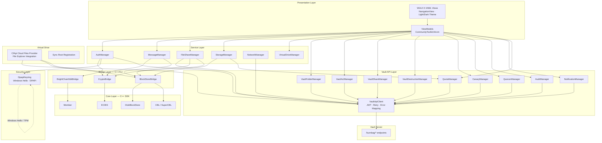
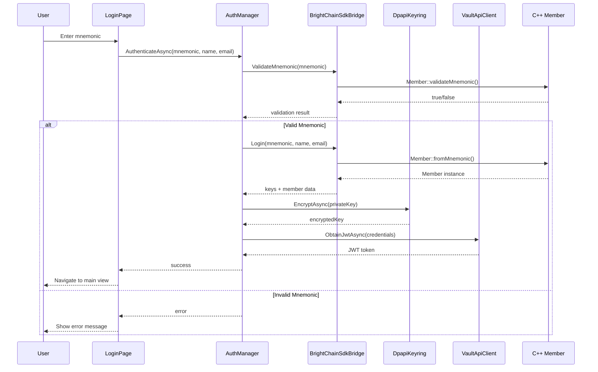
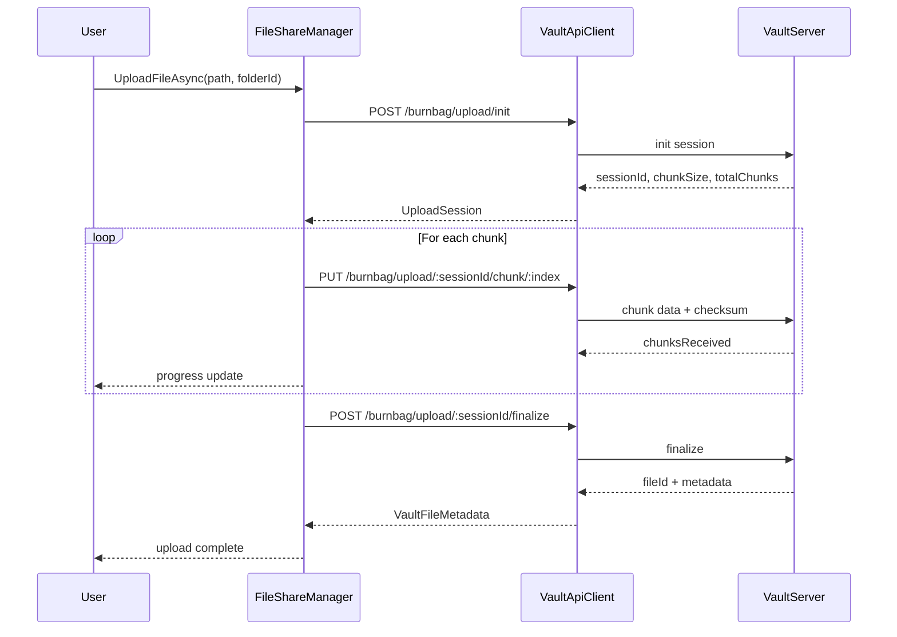

# Design Document: BrightChain Windows Client

## Overview

The BrightChain Windows Client is a WinUI 3 (Windows App SDK) desktop application targeting Windows 10 (1809+) and Windows 11 that provides a comprehensive interface to the BrightChain distributed storage and encrypted communication system. The application integrates:

1. A local C++ BrightChain SDK (via C++/CLI bridge) for cryptographic operations and block storage
2. The DigitalBurnbag Vault HTTP API (`/burnbag/*`) as the server-side backend for file operations, folder management, access control, sharing, destruction, canary protocols, quorum governance, audit logging, and notifications

The architecture follows a layered approach:
1. **Presentation Layer**: WinUI 3 XAML views with MVVM pattern using CommunityToolkit.Mvvm
2. **Service Layer**: C# services coordinating business logic
3. **Vault API Layer**: Pure C# HttpClient for all Vault API communication (no C++/CLI bridge needed)
4. **Bridge Layer**: C++/CLI wrappers exposing C++ SDK functionality to managed C#
5. **Core Layer**: C++ BrightChain SDK (member management, block storage, cryptography)

Key design decisions:
- Use Windows DPAPI / Windows Hello (TPM 2.0) for hardware-backed private key protection
- Implement virtual drive using Windows Cloud Files API (CfApi) for File Explorer integration
- Hybrid storage: local BlockStore for blocks/CBLs + server Vault for file management, folders, ACLs, sharing, destruction
- Vault API layer is pure C# with `HttpClient` — no C++/CLI bridge required
- Support offline operation with sync-on-reconnect capability
- MVVM with CommunityToolkit.Mvvm for observable properties and commands
- WinUI 3 NavigationView with left navigation pane for primary navigation
- Support Windows light/dark themes and system accent colors

## Architecture




### Component Interaction Flow — Authentication with JWT



### Component Interaction Flow — Chunked Upload via Vault API



## Components and Interfaces

### 1. Authentication Components

#### AuthManager
```csharp
public interface IAuthManager
{
    MemberModel? CurrentMember { get; }
    bool IsAuthenticated { get; }

    Task<(MemberModel Member, string Mnemonic)> RegisterAsync(string name, string email);
    Task<MemberModel> LoginAsync(string mnemonic, string name, string email);
    Task LogoutAsync();
    bool ValidateMnemonic(string mnemonic);
}

public partial class AuthManager : ObservableObject, IAuthManager
{
    [ObservableProperty] private MemberModel? _currentMember;

    private readonly IBrightChainSdkBridge _sdkBridge;
    private readonly IDpapiKeyring _keyring;
    private readonly IVaultApiClient _vaultClient;
}
```

#### DpapiKeyring
```csharp
public interface IDpapiKeyring
{
    Task<byte[]> EncryptAsync(byte[] data);
    Task<byte[]> DecryptAsync(byte[] encryptedData);
    Task DeleteKeyAsync();
    bool HasKey();
}

/// Uses Windows Hello (TPM 2.0) when available, falls back to DPAPI user-scope protection.
public class DpapiKeyring : IDpapiKeyring
{
    private readonly bool _windowsHelloAvailable;

    public Task<byte[]> EncryptAsync(byte[] data);   // Windows Hello or DPAPI
    public Task<byte[]> DecryptAsync(byte[] data);    // biometric, PIN, or password auth
    public Task DeleteKeyAsync();
}
```

### 2. Messaging Components

#### MessageManager
```csharp
public interface IMessageManager
{
    IReadOnlyList<Conversation> Conversations { get; }

    Task LoadConversationsAsync();
    Task<Conversation> CreateConversationAsync(IReadOnlyList<byte[]> recipientIds);
    Task<Message> SendMessageAsync(Conversation conversation, MessageContent content);
    Task<IReadOnlyList<Message>> LoadMessagesAsync(Conversation conversation, int limit, DateTime? before = null);
    Task DeleteConversationAsync(Conversation conversation);
}

public partial class MessageManager : ObservableObject, IMessageManager
{
    [ObservableProperty] private List<Conversation> _conversations = new();

    private readonly IBlockStoreService _blockStore;
    private readonly ICryptoService _cryptoService;
    private readonly IAuthManager _authManager;
}
```

#### CryptoService
```csharp
public interface ICryptoService
{
    byte[] Encrypt(byte[] data, IReadOnlyList<byte[]> recipientPublicKeys);
    byte[] Decrypt(byte[] data, byte[] privateKey);
    byte[] Sign(byte[] data, byte[] privateKey);
    bool Verify(byte[] signature, byte[] data, byte[] publicKey);
}

public class CryptoService : ICryptoService
{
    private readonly ICryptoBridge _bridge;
}
```

### 3. Vault API Layer Components

#### VaultApiClient — Core HTTP Client (Req 16)
```csharp
public interface IVaultApiClient
{
    Task<T> RequestAsync<T>(VaultEndpoint endpoint, CancellationToken ct = default);
    Task<byte[]> RequestDataAsync(VaultEndpoint endpoint, CancellationToken ct = default);
    Task<byte[]> UploadAsync(byte[] data, VaultEndpoint endpoint, IDictionary<string, string>? headers = null, CancellationToken ct = default);
}

public class VaultApiClient : IVaultApiClient
{
    private readonly HttpClient _httpClient;
    private string? _jwt;
    private DateTime? _jwtExpiry;
    private readonly Uri _baseUrl;
    private readonly TimeSpan _timeout;

    /// Attaches JWT Bearer header to every authenticated request (Req 16.1)
    /// Refreshes JWT on 401 before retrying (Req 16.2)
    /// Maps HTTP errors to typed VaultApiException (Req 16.3)
    /// Retries non-destructive requests with exponential backoff up to 3 times (Req 16.4)
    /// Serializes/deserializes JSON via System.Text.Json (Req 16.5)
    /// Validates hex ID format before sending (Req 16.6)
    /// Configurable base URL and timeout from AppSettings (Req 16.7)
}

public class VaultApiException : Exception
{
    public VaultApiErrorKind Kind { get; }
    public string ServerMessage { get; }
    public int StatusCode { get; }
}

public enum VaultApiErrorKind
{
    BadRequest,       // 400
    Unauthorized,     // 401
    Forbidden,        // 403
    NotFound,         // 404
    Conflict,         // 409
    Gone,             // 410
    QuotaExceeded,    // 413
    Unprocessable,    // 422
    NetworkError,
    InvalidIdFormat,
    DeserializationError
}
```

#### VaultFolderManager (Req 17)
```csharp
public interface IVaultFolderManager
{
    Task<FolderContents> GetRootFolderAsync();
    Task<FolderContents> GetFolderContentsAsync(string id, SortField? sortField = null, SortDirection? sortDirection = null);
    Task<VaultFolder> CreateFolderAsync(string name, string parentFolderId);
    Task<IReadOnlyList<BreadcrumbItem>> GetBreadcrumbPathAsync(string folderId);
    Task MoveItemAsync(string id, ItemType itemType, string newParentId);
}

public partial class VaultFolderManager : ObservableObject, IVaultFolderManager
{
    private readonly IVaultApiClient _client;
}
```

#### VaultAclManager (Req 18)
```csharp
public interface IVaultAclManager
{
    Task<AclDocument> GetAclAsync(AclTargetType targetType, string targetId);
    Task SetAclAsync(AclTargetType targetType, string targetId, IReadOnlyList<AclEntry> entries);
    Task<EffectivePermissions> GetEffectivePermissionsAsync(AclTargetType targetType, string targetId, string principalId);
    Task<PermissionSet> CreatePermissionSetAsync(string name, IReadOnlyList<PermissionFlag> flags, string? organizationId = null);
    Task<IReadOnlyList<PermissionSet>> ListPermissionSetsAsync(string? organizationId = null);
}

public partial class VaultAclManager : ObservableObject, IVaultAclManager
{
    private readonly IVaultApiClient _client;
}
```

#### VaultShareManager (Req 19)
```csharp
public interface IVaultShareManager
{
    Task ShareInternalAsync(string fileId, string recipientId, string? permissionLevel = null);
    Task<ShareLink> CreateShareLinkAsync(string fileId, ShareLinkMode mode, string? password = null, DateTime? expiresAt = null, int? maxAccessCount = null, string? recipientPublicKey = null);
    Task<IReadOnlyList<SharedFile>> GetSharedWithMeAsync();
    Task RevokeShareLinkAsync(string id);
    Task<string> GetMagnetUrlAsync(string fileId);
    Task<IReadOnlyList<ShareAuditEntry>> GetShareAuditAsync(string fileId);
}

public partial class VaultShareManager : ObservableObject, IVaultShareManager
{
    private readonly IVaultApiClient _client;
}
```

#### VaultDestructionManager (Req 20)
```csharp
public interface IVaultDestructionManager
{
    Task<DestructionResult> DestroyImmediatelyAsync(string fileId);
    Task ScheduleDestructionAsync(string fileId, DateTime scheduledAt);
    Task CancelScheduledDestructionAsync(string fileId);
    Task<BatchDestructionResult> DestroyBatchAsync(IReadOnlyList<string> fileIds);
    Task<ProofVerification> VerifyProofAsync(string fileId, DestructionProof proof, VerificationBundle bundle);
}

public partial class VaultDestructionManager : ObservableObject, IVaultDestructionManager
{
    private readonly IVaultApiClient _client;
}
```

#### CanaryManager (Req 21)
```csharp
public interface ICanaryManager
{
    Task<IReadOnlyList<CanaryBinding>> ListBindingsAsync();
    Task<IReadOnlyList<RecipientList>> ListRecipientListsAsync();
    Task<CanaryBinding> CreateBindingAsync(CreateCanaryBindingRequest request);
    Task<RecipientList> CreateRecipientListAsync(string name, IReadOnlyList<Recipient> recipients);
    Task<DryRunResult> DryRunAsync(string bindingId);
    Task<CanaryBinding> UpdateBindingAsync(string id, UpdateCanaryBindingRequest changes);
    Task DeleteBindingAsync(string id);
    Task<RecipientList> UpdateRecipientListAsync(string id, string? name, IReadOnlyList<Recipient>? recipients);
}

public partial class CanaryManager : ObservableObject, ICanaryManager
{
    private readonly IVaultApiClient _client;
}
```

#### QuorumManager (Req 22)
```csharp
public interface IQuorumManager
{
    Task<QuorumRequest> SubmitRequestAsync(QuorumOperationType operationType, string targetId, string targetType, string? reason = null);
    Task<QuorumApprovalResult> ApproveAsync(string requestId, byte[] signature);
    Task<QuorumRejectionResult> RejectAsync(string requestId, string? reason = null);
}

public partial class QuorumManager : ObservableObject, IQuorumManager
{
    private readonly IVaultApiClient _client;
    private readonly ICryptoService _cryptoService;  // for ECDSA signing
}
```

#### AuditManager (Req 23)
```csharp
public interface IAuditManager
{
    Task<IReadOnlyList<AuditEntry>> QueryAuditLogAsync(AuditFilters filters);
    Task<IReadOnlyList<AuditEntry>> ExportAuditLogAsync(AuditFilters filters);
    Task<ComplianceReport> GenerateComplianceReportAsync(ComplianceReportRequest request);
}

public partial class AuditManager : ObservableObject, IAuditManager
{
    private readonly IVaultApiClient _client;
}
```

#### NotificationManager (Req 24)
```csharp
public interface INotificationManager
{
    int UnreadCount { get; }
    IReadOnlyList<VaultNotification> Notifications { get; }

    Task PollNotificationsAsync();
    Task MarkAsReadAsync(IReadOnlyList<string> ids);
}

public partial class NotificationManager : ObservableObject, INotificationManager
{
    [ObservableProperty] private int _unreadCount;
    [ObservableProperty] private List<VaultNotification> _notifications = new();

    private readonly IVaultApiClient _client;
}
```

#### QuotaManager (Req 25)
```csharp
public interface IQuotaManager
{
    QuotaInfo? CurrentQuota { get; }
    Task<QuotaInfo> FetchQuotaAsync();
}

public partial class QuotaManager : ObservableObject, IQuotaManager
{
    [ObservableProperty] private QuotaInfo? _currentQuota;
    private readonly IVaultApiClient _client;
}
```


### 4. File Sharing Components (Updated for Vault API)

#### FileShareManager
```csharp
public interface IFileShareManager
{
    /// Upload via Vault chunked upload API (Req 6)
    Task<VaultFileMetadata> UploadFileAsync(string filePath, string? folderId, IProgress<double>? progress = null, CancellationToken ct = default);
    /// Download via Vault file endpoint (Req 7)
    Task DownloadFileAsync(string fileId, string destinationPath, IProgress<double>? progress = null, CancellationToken ct = default);
    /// Download specific version
    Task DownloadVersionAsync(string fileId, string versionId, string destinationPath, IProgress<double>? progress = null, CancellationToken ct = default);
    /// Search files via Vault API
    Task<FileSearchResult> SearchFilesAsync(FileSearchFilters filters);
    /// Get file metadata
    Task<VaultFileMetadata> GetFileMetadataAsync(string fileId);
    /// Soft-delete
    Task SoftDeleteAsync(string fileId);
    /// Restore soft-deleted
    Task RestoreAsync(string fileId);
    /// Get non-access proof
    Task<NonAccessProof> GetNonAccessProofAsync(string fileId);
    /// Resume interrupted upload
    Task<VaultFileMetadata> ResumeUploadAsync(string sessionId, IProgress<double>? progress = null, CancellationToken ct = default);

    // Legacy local operations
    FileReference ParseReference(string input);
    string GenerateMagnetUrl(FileReference reference);
    IReadOnlyList<string> GetMissingBlocks(FileReference reference);
}

public partial class FileShareManager : ObservableObject, IFileShareManager
{
    private readonly IVaultApiClient _vaultClient;
    private readonly IBlockStoreService _blockStore;
    private readonly ICryptoService _cryptoService;
}
```

### 5. Storage Components

#### BlockStoreService
```csharp
public interface IBlockStoreService
{
    string Store(byte[] data, BlockSize size);
    byte[] Retrieve(string checksum);
    bool Exists(string checksum);
    bool Delete(string checksum);
    StorageStats GetStorageStats();
    Task<CleanupResult> CleanupAsync(CleanupPolicy policy);
}

public partial class BlockStoreService : ObservableObject, IBlockStoreService
{
    private readonly IBlockStoreBridge _bridge;
    private readonly string _storePath;
    [ObservableProperty] private StorageStats _stats;
}
```

#### StorageManager (Updated for server quota — Req 8, 25)
```csharp
public interface IStorageManager
{
    StorageStats StorageStats { get; }
    ulong StorageLimit { get; set; }
    QuotaInfo? ServerQuota { get; }

    IDictionary<StorageCategory, ulong> GetUsageByCategory();
    void SetStorageLimit(ulong limit);
    Task<CleanupResult> PerformCleanupAsync();
    Task<IntegrityReport> VerifyIntegrityAsync();
    Task<QuotaInfo> RefreshServerQuotaAsync();
}

public partial class StorageManager : ObservableObject, IStorageManager
{
    private readonly IBlockStoreService _blockStore;
    private readonly IQuotaManager _quotaManager;
}
```

### 6. Virtual Drive Components (CfApi)

#### VirtualDriveManager
```csharp
public interface IVirtualDriveManager
{
    bool IsRegistered { get; }
    string SyncRootPath { get; }
    IReadOnlyList<VirtualFileEntry> AvailableContent { get; }

    Task RegisterAsync(string syncRootPath);
    Task UnregisterAsync();
    Task ImportReferenceAsync(FileReference reference);
    Task RemoveContentAsync(VirtualFileEntry entry);
}

/// Backed by CfApi sync root + Vault folder hierarchy + local CBL catalog
public partial class VirtualDriveManager : ObservableObject, IVirtualDriveManager
{
    [ObservableProperty] private bool _isRegistered;
    [ObservableProperty] private List<VirtualFileEntry> _availableContent = new();

    private readonly ICfApiProvider _cfApiProvider;
    private readonly IBlockStoreService _blockStore;
    private readonly ContentCatalog _catalog;
    private readonly IVaultFolderManager _vaultFolderManager;
}
```

#### CfApiProvider (Windows Cloud Files API)
```csharp
public interface ICfApiProvider
{
    Task RegisterSyncRootAsync(string path, string displayName);
    Task UnregisterSyncRootAsync(string path);
    Task CreatePlaceholderAsync(string relativePath, FileIdentity identity, long fileSize);
    Task HydratePlaceholderAsync(string relativePath, Stream content);
    Task DehydratePlaceholderAsync(string relativePath);
}

/// P/Invoke wrapper around CfApi (cfapi.h) for cloud file placeholder management
public class CfApiProvider : ICfApiProvider
{
    // CfRegisterSyncRoot, CfUnregisterSyncRoot, CfCreatePlaceholders,
    // CfHydratePlaceholder, CfDehydratePlaceholder via P/Invoke
}
```

### 7. Network Components

#### NetworkManager
```csharp
public interface INetworkManager
{
    ConnectionStatus Status { get; }
    IReadOnlyList<PeerInfo> ConnectedPeers { get; }
    bool VaultApiReachable { get; }

    Task ConnectAsync();
    Task DisconnectAsync();
    Task<byte[]> RequestBlockAsync(string checksum);
    Task AnnounceBlockAsync(string checksum);
    Task SyncPendingOperationsAsync();
    Task<bool> CheckVaultApiReachabilityAsync();
}

public partial class NetworkManager : ObservableObject, INetworkManager
{
    [ObservableProperty] private ConnectionStatus _status = ConnectionStatus.Disconnected;
    [ObservableProperty] private List<PeerInfo> _connectedPeers = new();
    [ObservableProperty] private bool _vaultApiReachable;

    private readonly List<PendingOperation> _pendingOperations = new();
    private readonly IVaultApiClient _vaultClient;
}
```

### 8. SDK Bridge Components (C++/CLI)

#### BrightChainSdkBridge
```cpp
// C++/CLI managed wrapper — compiles as /clr
public ref class BrightChainSdkBridge
{
public:
    // Member operations
    bool ValidateMnemonic(System::String^ mnemonic);
    System::String^ GenerateMnemonic();
    cli::array<System::Byte>^ Login(System::String^ mnemonic, System::String^ name, System::String^ email,
                                     [Out] cli::array<System::Byte>^% publicKey,
                                     [Out] cli::array<System::Byte>^% memberId);
    cli::array<System::Byte>^ CreateMember(System::String^ mnemonic, System::String^ name, System::String^ email,
                                            [Out] cli::array<System::Byte>^% publicKey,
                                            [Out] cli::array<System::Byte>^% memberId);

    // Signing operations
    cli::array<System::Byte>^ SignData(cli::array<System::Byte>^ data, cli::array<System::Byte>^ privateKey);
    bool VerifySignature(cli::array<System::Byte>^ signature, cli::array<System::Byte>^ data, cli::array<System::Byte>^ publicKey);
};
```

#### BlockStoreBridge
```cpp
// C++/CLI managed wrapper
public ref class BlockStoreBridge
{
public:
    BlockStoreBridge(System::String^ storePath, int blockSize);

    System::String^ StoreBlock(cli::array<System::Byte>^ data);
    System::String^ StoreBlockWithMetadata(cli::array<System::Byte>^ data,
                                            System::Collections::Generic::Dictionary<System::String^, System::String^>^ metadata);
    cli::array<System::Byte>^ GetBlock(System::String^ checksum);
    bool HasBlock(System::String^ checksum);
    bool DeleteBlock(System::String^ checksum);
    System::Collections::Generic::Dictionary<System::String^, System::String^>^ GetMetadata(System::String^ checksum);
    System::Collections::Generic::Dictionary<System::String^, System::Object^>^ GetStats();
};
```

#### CryptoBridge
```cpp
// C++/CLI managed wrapper
public ref class CryptoBridge
{
public:
    cli::array<System::Byte>^ EncryptData(cli::array<System::Byte>^ data, cli::array<System::Byte>^ publicKey);
    cli::array<System::Byte>^ EncryptDataForRecipients(cli::array<System::Byte>^ data,
                                                         cli::array<cli::array<System::Byte>^>^ publicKeys);
    cli::array<System::Byte>^ DecryptData(cli::array<System::Byte>^ data, cli::array<System::Byte>^ privateKey);

    // CBL operations
    cli::array<System::Byte>^ CreateCbl(cli::array<System::String^>^ checksums,
                                         cli::array<System::Byte>^ creatorId,
                                         cli::array<System::Byte>^ privateKey,
                                         System::String^ originalChecksum,
                                         System::UInt64 originalDataLength);
    cli::array<System::String^>^ GetCblAddresses(cli::array<System::Byte>^ cblData);
};
```


## Data Models

### Member and Authentication

```csharp
public record MemberModel
{
    public Guid Id { get; init; }
    public byte[] MemberId { get; init; } = Array.Empty<byte>();  // 16-byte BrightChain member ID
    public string Name { get; init; } = string.Empty;
    public string Email { get; init; } = string.Empty;
    public MemberType Type { get; init; }
    public byte[] PublicKey { get; init; } = Array.Empty<byte>();
    public DateTime DateCreated { get; init; }
    public DateTime DateUpdated { get; init; }
}

public enum MemberType { Admin, System, User, Anonymous }

public record SessionState
{
    public byte[] MemberId { get; init; } = Array.Empty<byte>();
    public byte[] EncryptedPrivateKey { get; init; } = Array.Empty<byte>();
    public DateTime LoginTime { get; init; }
    public DateTime LastActivity { get; set; }
    public string? Jwt { get; set; }
    public DateTime? JwtExpiry { get; set; }
}
```

### Messaging

```csharp
public record Conversation
{
    public Guid Id { get; init; }
    public IReadOnlyList<byte[]> Participants { get; init; } = Array.Empty<byte[]>();
    public DateTime CreatedAt { get; init; }
    public DateTime? LastMessageAt { get; set; }
    public string? LastMessagePreview { get; set; }
    public int UnreadCount { get; set; }
}

public record Message
{
    public Guid Id { get; init; }
    public Guid ConversationId { get; init; }
    public byte[] SenderId { get; init; } = Array.Empty<byte>();
    public DateTime Timestamp { get; init; }
    public MessageContent Content { get; init; } = new();
    public string CblChecksum { get; init; } = string.Empty;
    public MessageStatus Status { get; set; }
}

public enum MessageStatus { Sending, Sent, Delivered, Read, Failed }

public record MessageContent
{
    public string? Text { get; init; }
    public IReadOnlyList<AttachmentReference>? Attachments { get; init; }
}

public record AttachmentReference
{
    public string Filename { get; init; } = string.Empty;
    public string MimeType { get; init; } = string.Empty;
    public ulong Size { get; init; }
    public string CblChecksum { get; init; } = string.Empty;
}
```

### File Sharing (Local)

```csharp
public record FileReference
{
    public ReferenceType Type { get; init; }
    public string Checksum { get; init; } = string.Empty;
    public string Filename { get; init; } = string.Empty;
    public string MimeType { get; init; } = string.Empty;
    public ulong Size { get; init; }
    public DateTime CreatedAt { get; init; }
    public byte[]? CreatorId { get; init; }
}

public enum ReferenceType { Cbl, SuperCbl, MagnetUrl }

public record CblReference
{
    public string Checksum { get; init; } = string.Empty;
    public IReadOnlyList<string> BlockChecksums { get; init; } = Array.Empty<string>();
    public string OriginalChecksum { get; init; } = string.Empty;
    public ulong OriginalSize { get; init; }
    public int TupleSize { get; init; }
    public byte[] Signature { get; init; } = Array.Empty<byte>();
}

public record SuperCblReference
{
    public string Checksum { get; init; } = string.Empty;
    public IReadOnlyList<string> SubCblChecksums { get; init; } = Array.Empty<string>();
    public int TotalBlockCount { get; init; }
    public int Depth { get; init; }
    public string OriginalChecksum { get; init; } = string.Empty;
    public ulong OriginalSize { get; init; }
    public byte[] Signature { get; init; } = Array.Empty<byte>();
}

public record MagnetUrl
{
    public string InfoHash { get; init; } = string.Empty;
    public string? DisplayName { get; init; }
    public ulong? Size { get; init; }
    public IReadOnlyList<string> Checksums { get; init; } = Array.Empty<string>();

    public override string ToString();
    public static MagnetUrl Parse(string urlString);
}
```

### Vault API Models

```csharp
// --- File Metadata (from Vault API responses) ---

public record VaultFileMetadata
{
    public string Id { get; init; } = string.Empty;
    public string Name { get; init; } = string.Empty;
    public string OwnerId { get; init; } = string.Empty;
    public string FolderId { get; init; } = string.Empty;
    public string FileName { get; init; } = string.Empty;
    public string MimeType { get; init; } = string.Empty;
    public ulong SizeBytes { get; init; }
    public string? Description { get; init; }
    public IReadOnlyList<string> Tags { get; init; } = Array.Empty<string>();
    public string CurrentVersionId { get; init; } = string.Empty;
    public string? VaultCreationLedgerEntryHash { get; init; }
    public string? AclId { get; init; }
    public DateTime? DeletedAt { get; init; }
    public DateTime? ScheduledDestructionAt { get; init; }
    public bool QuorumGoverned { get; init; }
    public bool VisibleWatermark { get; init; }
    public bool InvisibleWatermark { get; init; }
    public DateTime CreatedAt { get; init; }
    public DateTime UpdatedAt { get; init; }
    public DateTime? ModifiedAt { get; init; }
    public string? CreatedBy { get; init; }
    public string? UpdatedBy { get; init; }
}

public record FileVersion
{
    public string VersionId { get; init; } = string.Empty;
    public int VersionNumber { get; init; }
    public ulong SizeBytes { get; init; }
    public DateTime CreatedAt { get; init; }
    public string CreatedBy { get; init; } = string.Empty;
    public bool IsCurrent { get; init; }
}

public record FileSearchResult
{
    public IReadOnlyList<VaultFileMetadata> Results { get; init; } = Array.Empty<VaultFileMetadata>();
    public int Total { get; init; }
}

public record FileSearchFilters
{
    public string? Query { get; init; }
    public IReadOnlyList<string>? Tags { get; init; }
    public string? MimeType { get; init; }
    public string? FolderId { get; init; }
    public DateTime? DateFrom { get; init; }
    public DateTime? DateTo { get; init; }
    public ulong? SizeMin { get; init; }
    public ulong? SizeMax { get; init; }
    public bool? Deleted { get; init; }
}

// --- Upload Session ---

public record UploadSession
{
    public string SessionId { get; init; } = string.Empty;
    public int ChunkSize { get; init; }
    public int TotalChunks { get; init; }
}

public record UploadChunkResult
{
    public int ChunkIndex { get; init; }
    public int ChunksReceived { get; init; }
    public int TotalChunks { get; init; }
}

public record UploadSessionStatus
{
    public string SessionId { get; init; } = string.Empty;
    public string Status { get; init; } = string.Empty;
    public int ChunksReceived { get; init; }
    public int TotalChunks { get; init; }
    public string FileName { get; init; } = string.Empty;
    public ulong TotalSizeBytes { get; init; }
}

// --- Folders ---

public record VaultFolder
{
    public string Id { get; init; } = string.Empty;
    public string Name { get; init; } = string.Empty;
    public string OwnerId { get; init; } = string.Empty;
    public string? ParentFolderId { get; init; }
    public bool QuorumGoverned { get; init; }
    public DateTime CreatedAt { get; init; }
    public DateTime UpdatedAt { get; init; }
}

public record FolderContents
{
    public VaultFolder Folder { get; init; } = new();
    public IReadOnlyList<VaultFileMetadata> Files { get; init; } = Array.Empty<VaultFileMetadata>();
    public IReadOnlyList<VaultFolder> Subfolders { get; init; } = Array.Empty<VaultFolder>();
}

public record BreadcrumbItem
{
    public string Id { get; init; } = string.Empty;
    public string Name { get; init; } = string.Empty;
}

public enum SortField { Name, Size, ModifiedDate, Type }
public enum SortDirection { Asc, Desc }
public enum ItemType { File, Folder }

// --- ACL ---

[Flags]
public enum PermissionFlag
{
    None = 0,
    Read = 1,
    Write = 2,
    Delete = 4,
    Share = 8,
    Admin = 16,
    Preview = 32,
    Comment = 64,
    Download = 128,
    ManageVersions = 256
}

public enum PermissionLevel { Viewer, Commenter, Editor, Owner }

public record AclEntry
{
    public string PrincipalId { get; init; } = string.Empty;
    public PermissionLevel? Level { get; init; }
    public PermissionFlag? Flags { get; init; }
    public string? CustomPermissionSetId { get; init; }
}

public record AclDocument
{
    public IReadOnlyList<AclEntry> Entries { get; init; } = Array.Empty<AclEntry>();
}

public record EffectivePermissions
{
    public PermissionFlag Flags { get; init; }
    public PermissionLevel? Level { get; init; }
    public bool Inherited { get; init; }
    public string? Source { get; init; }
}

public record PermissionSet
{
    public string Id { get; init; } = string.Empty;
    public string Name { get; init; } = string.Empty;
    public IReadOnlyList<PermissionFlag> FlagsList { get; init; } = Array.Empty<PermissionFlag>();
    public string? OrganizationId { get; init; }
    public string CreatedBy { get; init; } = string.Empty;
}

public enum AclTargetType { File, Folder }

// --- Sharing ---

public enum ShareLinkMode { ServerProxied, EphemeralKeyPair, RecipientPublicKey }

public record ShareLink
{
    public string Token { get; init; } = string.Empty;
    public string Url { get; init; } = string.Empty;
    public ShareLinkMode Mode { get; init; }
    public DateTime? ExpiresAt { get; init; }
    public int? MaxAccessCount { get; init; }
    public int AccessCount { get; init; }
}

public record SharedFile
{
    public string FileId { get; init; } = string.Empty;
    public string FileName { get; init; } = string.Empty;
    public string SharedBy { get; init; } = string.Empty;
    public string PermissionLevel { get; init; } = string.Empty;
    public DateTime SharedAt { get; init; }
}

public record ShareAuditEntry
{
    public string Action { get; init; } = string.Empty;
    public string? Token { get; init; }
    public string? RecipientId { get; init; }
    public string? PermissionLevel { get; init; }
    public string? IpAddress { get; init; }
    public DateTime Timestamp { get; init; }
}

// --- Destruction ---

public record DestructionProof
{
    public string MerkleRoot { get; init; } = string.Empty;
    public string BloomWitness { get; init; } = string.Empty;
    public DateTime Timestamp { get; init; }
}

public record VerificationBundle
{
    public string LedgerEntryHash { get; init; } = string.Empty;
    public int BlockHeight { get; init; }
    public string ChainId { get; init; } = string.Empty;
}

public record DestructionResult
{
    public bool Destroyed { get; init; }
    public DestructionProof Proof { get; init; } = new();
    public VerificationBundle VerificationBundle { get; init; } = new();
}

public record BatchDestructionResult
{
    public IReadOnlyList<BatchDestructionItem> Results { get; init; } = Array.Empty<BatchDestructionItem>();
}

public record BatchDestructionItem
{
    public string FileId { get; init; } = string.Empty;
    public bool Destroyed { get; init; }
    public DestructionProof? Proof { get; init; }
    public string? Error { get; init; }
}

public record ProofVerification
{
    public bool Valid { get; init; }
    public DateTime VerifiedAt { get; init; }
    public bool LedgerConfirmed { get; init; }
}

// --- Non-Access Proof ---

public record NonAccessProof
{
    public NonAccessProofData Proof { get; init; } = new();
    public VerificationBundle VerificationBundle { get; init; } = new();
}

public record NonAccessProofData
{
    public string BloomWitness { get; init; } = string.Empty;
    public string MerkleRoot { get; init; } = string.Empty;
    public IReadOnlyList<string> MerkleProof { get; init; } = Array.Empty<string>();
    public DateTime Timestamp { get; init; }
}

// --- Canary ---

public record CanaryBinding
{
    public string Id { get; init; } = string.Empty;
    public string ProtocolId { get; init; } = string.Empty;
    public string ProtocolAction { get; init; } = string.Empty;
    public string CanaryCondition { get; init; } = string.Empty;
    public string CanaryProvider { get; init; } = string.Empty;
    public IReadOnlyList<string> FileIds { get; init; } = Array.Empty<string>();
    public IReadOnlyList<string> FolderIds { get; init; } = Array.Empty<string>();
    public string? RecipientListId { get; init; }
    public IReadOnlyList<string> CascadeBindingIds { get; init; } = Array.Empty<string>();
    public bool Enabled { get; init; }
    public int? TimeoutMs { get; init; }
    public DateTime? LastSignalAt { get; init; }
    public string CreatedBy { get; init; } = string.Empty;
    public DateTime CreatedAt { get; init; }
    public DateTime UpdatedAt { get; init; }
}

public record CreateCanaryBindingRequest
{
    public string ProtocolAction { get; init; } = string.Empty;
    public string CanaryCondition { get; init; } = string.Empty;
    public string CanaryProvider { get; init; } = string.Empty;
    public IReadOnlyList<string>? FileIds { get; init; }
    public IReadOnlyList<string>? FolderIds { get; init; }
    public string? RecipientListId { get; init; }
    public int? TimeoutMs { get; init; }
    public IReadOnlyList<int>? CascadeDelayMs { get; init; }
}

public record UpdateCanaryBindingRequest
{
    public bool? Enabled { get; init; }
    public int? TimeoutMs { get; init; }
    public string? ProtocolAction { get; init; }
    public string? CanaryCondition { get; init; }
    public string? CanaryProvider { get; init; }
}

public record RecipientList
{
    public string Id { get; init; } = string.Empty;
    public string Name { get; init; } = string.Empty;
    public string OwnerId { get; init; } = string.Empty;
    public IReadOnlyList<Recipient> Recipients { get; init; } = Array.Empty<Recipient>();
    public DateTime CreatedAt { get; init; }
    public DateTime UpdatedAt { get; init; }
}

public record Recipient
{
    public string Name { get; init; } = string.Empty;
    public string Email { get; init; } = string.Empty;
    public string? PublicKey { get; init; }
}

public record DryRunResult
{
    public string BindingId { get; init; } = string.Empty;
    public IReadOnlyList<string> FilesAffected { get; init; } = Array.Empty<string>();
    public IReadOnlyList<string> FoldersAffected { get; init; } = Array.Empty<string>();
    public int AffectedFileCount { get; init; }
    public int RecipientCount { get; init; }
    public IReadOnlyList<string> ActionsDescription { get; init; } = Array.Empty<string>();
}

// --- Quorum ---

public enum QuorumOperationType { Destruction, ExternalShare, BulkDelete, AclChange }

public record QuorumRequest
{
    public string RequestId { get; init; } = string.Empty;
    public string OperationType { get; init; } = string.Empty;
    public string TargetId { get; init; } = string.Empty;
    public string Status { get; init; } = string.Empty;
    public int RequiredApprovals { get; init; }
    public int CurrentApprovals { get; init; }
    public int CurrentRejections { get; init; }
    public DateTime CreatedAt { get; init; }
    public DateTime ExpiresAt { get; init; }
}

public record QuorumApprovalResult
{
    public string RequestId { get; init; } = string.Empty;
    public string Status { get; init; } = string.Empty;
    public int CurrentApprovals { get; init; }
    public int RequiredApprovals { get; init; }
    public bool Executed { get; init; }
    public QuorumExecutionResult? ExecutionResult { get; init; }
}

public record QuorumExecutionResult
{
    public bool? Destroyed { get; init; }
    public DestructionProof? Proof { get; init; }
}

public record QuorumRejectionResult
{
    public string RequestId { get; init; } = string.Empty;
    public string Status { get; init; } = string.Empty;
    public int CurrentApprovals { get; init; }
    public int CurrentRejections { get; init; }
    public int RequiredApprovals { get; init; }
}

// --- Audit ---

public record AuditEntry
{
    public string Id { get; init; } = string.Empty;
    public string ActorId { get; init; } = string.Empty;
    public string TargetId { get; init; } = string.Empty;
    public string OperationType { get; init; } = string.Empty;
    public AuditDetails? Details { get; init; }
    public string LedgerEntryHash { get; init; } = string.Empty;
    public DateTime Timestamp { get; init; }
}

public record AuditDetails
{
    public string? IpAddress { get; init; }
    public string? UserAgent { get; init; }
}

public record AuditFilters
{
    public string? ActorId { get; init; }
    public string? TargetId { get; init; }
    public string? OperationType { get; init; }
    public DateTime? DateFrom { get; init; }
    public DateTime? DateTo { get; init; }
    public int? Page { get; init; }
    public int? PageSize { get; init; }
}

public record ComplianceReportRequest
{
    public DateTime DateFrom { get; init; }
    public DateTime DateTo { get; init; }
    public bool? IncludeAccessPatterns { get; init; }
    public bool? IncludeDestructionEvents { get; init; }
    public bool? IncludeSharingActivity { get; init; }
    public bool? IncludeNonAccessProofs { get; init; }
}

public record ComplianceReport
{
    public ReportPeriod Period { get; init; } = new();
    public ReportSummary Summary { get; init; } = new();
    public AccessPatterns? AccessPatterns { get; init; }
    public DestructionEvents? DestructionEvents { get; init; }
    public SharingActivity? SharingActivity { get; init; }
    public NonAccessProofsSummary? NonAccessProofs { get; init; }
}

public record ReportPeriod(DateTime From, DateTime To);
public record ReportSummary(int TotalOperations, int UniqueActors, int UniqueTargets);
public record AccessPatterns(int TotalAccesses, int UniqueFiles, int PeakHour);
public record DestructionEvents(int TotalDestructions, int ScheduledDestructions, int ImmediateDestructions, bool AllProofsValid);
public record SharingActivity(int InternalShares, int ExternalLinks, int RevokedLinks);
public record NonAccessProofsSummary(int TotalProofs, bool AllValid);

// --- Notifications ---

public record VaultNotification
{
    public string Id { get; init; } = string.Empty;
    public string Type { get; init; } = string.Empty;
    public string Title { get; init; } = string.Empty;
    public string Message { get; init; } = string.Empty;
    public string? TargetId { get; init; }
    public string? TargetType { get; init; }
    public DateTime CreatedAt { get; init; }
    public bool Read { get; init; }
}

// --- Quota ---

public record QuotaInfo
{
    public ulong UsedBytes { get; init; }
    public ulong QuotaBytes { get; init; }
    public IReadOnlyList<QuotaBreakdownItem> Breakdown { get; init; } = Array.Empty<QuotaBreakdownItem>();

    public double UsagePercentage => QuotaBytes > 0 ? (double)UsedBytes / QuotaBytes * 100.0 : 0.0;
}

public record QuotaBreakdownItem(string Category, ulong UsedBytes);

// --- TCBL Export ---

public record TcblExportRequest
{
    public IReadOnlyList<string>? MimeTypeFilters { get; init; }
    public int? MaxDepth { get; init; }
    public IReadOnlyList<string>? ExcludePatterns { get; init; }
}

public record TcblExportResult
{
    public string Format { get; init; } = string.Empty;
    public string FolderName { get; init; } = string.Empty;
    public int TotalFiles { get; init; }
    public ulong TotalSizeBytes { get; init; }
    public string Data { get; init; } = string.Empty;
    public IReadOnlyList<SkippedFile>? SkippedFiles { get; init; }
}

public record SkippedFile(string FileId, string Reason);
```

### Storage (Local)

```csharp
public record StorageStats
{
    public ulong TotalUsed { get; init; }
    public ulong TotalAvailable { get; init; }
    public IReadOnlyDictionary<BlockSize, int> BlockCounts { get; init; } = new Dictionary<BlockSize, int>();
    public IReadOnlyDictionary<StorageCategory, ulong> CategoryUsage { get; init; } = new Dictionary<StorageCategory, ulong>();
}

public enum StorageCategory { Messages, Files, System, Cache }

public enum BlockSize
{
    Message = 512,
    Tiny = 1024,
    Small = 4096,
    Medium = 1_048_576,
    Large = 67_108_864,
    Huge = 268_435_456
}

public record CleanupPolicy
{
    public TimeSpan? MaxAge { get; init; }
    public ulong? MaxSize { get; init; }
    public IReadOnlyList<StorageCategory> PreserveCategories { get; init; } = Array.Empty<StorageCategory>();
    public bool OrphanedBlocksOnly { get; init; }
}

public record CleanupResult
{
    public int BlocksRemoved { get; init; }
    public ulong BytesFreed { get; init; }
    public IReadOnlyList<string> Errors { get; init; } = Array.Empty<string>();
}

public record IntegrityReport
{
    public int TotalBlocks { get; init; }
    public int VerifiedBlocks { get; init; }
    public IReadOnlyList<string> CorruptedBlocks { get; init; } = Array.Empty<string>();
    public IReadOnlyList<string> MissingBlocks { get; init; } = Array.Empty<string>();
}
```

### Virtual Drive

```csharp
public record VirtualFileEntry
{
    public Guid Id { get; init; }
    public string Filename { get; init; } = string.Empty;
    public string MimeType { get; init; } = string.Empty;
    public ulong Size { get; init; }
    public FileReference Reference { get; init; } = new();
    public DateTime AddedAt { get; init; }
    public bool IsAvailable { get; set; }
    public IReadOnlyList<string>? MissingBlocks { get; set; }
}

public class ContentCatalog
{
    public List<VirtualFileEntry> Entries { get; set; } = new();
    public DateTime LastUpdated { get; set; }

    public void Add(VirtualFileEntry entry);
    public void Remove(Guid id);
    public VirtualFileEntry? Find(string checksum);
}

public record FileIdentity(string FileId, string FileName, long FileSize, DateTime ModifiedAt);
```

### Network

```csharp
public enum ConnectionStatus { Disconnected, Connecting, Connected, Error }

public record PeerInfo
{
    public string Id { get; init; } = string.Empty;
    public string Endpoint { get; init; } = string.Empty;
    public DateTime ConnectedAt { get; init; }
    public DateTime LastActivity { get; set; }
    public int BlocksExchanged { get; set; }
}

public record NetworkEndpoint
{
    public string Host { get; init; } = string.Empty;
    public int Port { get; init; }
    public bool IsDefault { get; init; }
}

public record PendingOperation
{
    public Guid Id { get; init; }
    public OperationType Type { get; init; }
    public byte[] Data { get; init; } = Array.Empty<byte>();
    public DateTime CreatedAt { get; init; }
    public int RetryCount { get; set; }
}

public enum OperationType { BlockRequest, BlockAnnounce, MessageSend }
```

### Settings

```csharp
public record AppSettings
{
    public string StoragePath { get; set; } = string.Empty;
    public ulong StorageLimit { get; set; }
    public string SyncRootPath { get; set; } = string.Empty;
    public bool VirtualDriveEnabled { get; set; }
    public List<NetworkEndpoint> NetworkEndpoints { get; set; } = new();
    public bool AutoConnect { get; set; }
    public ulong CacheSize { get; set; }
    public LogLevel LogLevel { get; set; }
    public string VaultApiBaseUrl { get; set; } = string.Empty;
    public TimeSpan VaultApiTimeout { get; set; } = TimeSpan.FromSeconds(30);

    public static AppSettings Default => new()
    {
        StoragePath = Path.Combine(Environment.GetFolderPath(Environment.SpecialFolder.LocalApplicationData), "BrightChain", "blocks"),
        StorageLimit = 10UL * 1024 * 1024 * 1024, // 10 GB
        SyncRootPath = Path.Combine(Environment.GetFolderPath(Environment.SpecialFolder.UserProfile), "BrightChain"),
        VirtualDriveEnabled = false,
        AutoConnect = true,
        CacheSize = 1UL * 1024 * 1024 * 1024, // 1 GB
        LogLevel = LogLevel.Info,
        VaultApiBaseUrl = "https://api.digitalburnbag.com",
        VaultApiTimeout = TimeSpan.FromSeconds(30)
    };
}

public enum LogLevel { Debug, Info, Warning, Error }
```
