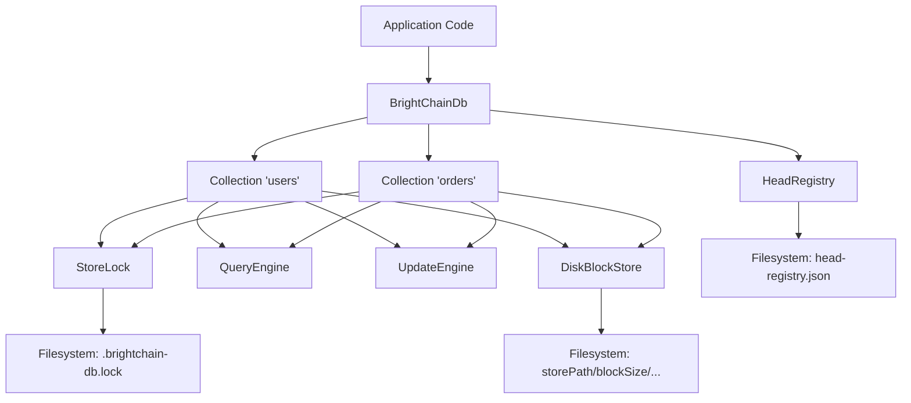

# Design Document: C++ BrightChain Database (brightchain-db)

## Overview

This design describes the C++ implementation of the BrightChain document database, a MongoDB-like document store backed by the existing `DiskBlockStore` content-addressable block storage. The system provides CRUD operations on JSON documents organized into named collections, with persistent metadata tracking via a head registry. All on-disk formats are byte-compatible with the existing TypeScript implementation, enabling cross-platform data portability.

The design builds directly on four existing C++ classes:
- `DiskBlockStore` — block storage with directory layout `storePath/blockSizeName/hex[0]/hex[1]/checksumHex`
- `Checksum` — SHA3-512 hashing (64 bytes, 128 hex chars)
- `BlockMetadata` — JSON sidecar with `size`, `created_at`, `length_without_padding`
- `BlockSize` — enum of standard block sizes (Message through Huge)

Key design decisions:
1. **nlohmann::json as the document type** — no custom BSON or wrapper; documents are `nlohmann::json` objects with a string `_id` field.
2. **Copy-on-write semantics** — blocks are immutable; updates create new blocks and remap the document index.
3. **Linear scan for queries** — no B-tree or inverted index; filter evaluation iterates all documents. Index metadata is stored for future use but not used for query optimization in this iteration.
4. **No transactions** — excluded from scope; single-threaded write model with atomic file operations for crash safety.
5. **Cross-platform store-level locking** — a file-based lock (`storePath/.brightchain-db.lock`) serializes write operations across C++ and TypeScript processes to prevent lost updates during concurrent read-modify-write cycles on collection metadata. Block writes themselves are safe due to content-addressability.

## Architecture



### Layer Responsibilities

| Layer | Responsibility |
|-------|---------------|
| `BrightChainDb` | Top-level API. Manages collections, connects/disconnects, owns HeadRegistry and StoreLock. |
| `StoreLock` | Cross-platform file-based lock at `storePath/.brightchain-db.lock`. Serializes write operations across C++ and TypeScript processes. RAII guard pattern. |
| `HeadRegistry` | Persists `dbName:collectionName → blockId` mappings to `head-registry.json`. Atomic writes, file locking. |
| `Collection` | CRUD operations, document index (`_id → checksum`), in-memory cache, lazy loading from head block. |
| `QueryEngine` | Stateless filter evaluation. Supports comparison, set, existence, and logical operators. |
| `UpdateEngine` | Stateless document mutation. Supports `$set`, `$unset`, `$inc`, `$push`, `$pull`, `$addToSet`, `$min`, `$max`, `$rename`, `$currentDate`, `$mul`, `$pop`. |
| `DiskBlockStore` | Existing class. Stores/retrieves raw byte blocks by SHA3-512 checksum. |

### Data Flow: Insert Document

1. App calls `collection.insertOne(doc)`
2. Collection acquires `StoreLock` (blocks until lock obtained or timeout)
3. Collection calls `ensureLoaded()` — reloads CollectionMeta from HeadRegistry if stale
4. Collection generates `_id` if missing (32-char hex UUID)
5. Document serialized to UTF-8 JSON bytes (compact, no BOM)
6. SHA3-512 computed on raw bytes → `Checksum`
7. Bytes stored via `DiskBlockStore::put(data, metadata)`
8. `docIndex[_id] = checksum.toHex()` updated in memory
9. `CollectionMeta` serialized as JSON, stored as new block
10. `HeadRegistry::setHead(dbName:collectionName, newMetaBlockId)` persisted atomically
11. `StoreLock` released (RAII)

### Data Flow: Load Collection

1. App calls `collection.find(filter)`
2. Collection calls `ensureLoaded()` if not yet loaded
3. `HeadRegistry::getHead(dbName:collectionName)` returns meta block ID
4. Meta block retrieved from `DiskBlockStore::get(checksum)`
5. `CollectionMeta` deserialized: `mappings` restored to `docIndex`
6. Documents loaded lazily from block store on access
7. `QueryEngine::matchesFilter(doc, filter)` evaluated per document

## Components and Interfaces

### 1. Error Types (`include/brightchain/db_errors.hpp`)

```cpp
namespace brightchain::db {

enum class ErrorCode : int {
    DocumentNotFound = 404,
    ValidationError = 121,
    DuplicateKey = 11000,
    IndexError = 86,
    RegistryError = 500
};

class DbError : public std::runtime_error {
public:
    DbError(ErrorCode code, const std::string& message);
    ErrorCode code() const;
};

class DocumentNotFoundError : public DbError { /* code=404 */ };
class ValidationError : public DbError { /* code=121 */ };
class DuplicateKeyError : public DbError { /* code=11000 */ };
class IndexError : public DbError { /* code=86 */ };
class RegistryError : public DbError { /* code=500 */ };

} // namespace brightchain::db
```

### 2. Document Type (`include/brightchain/document.hpp`)

Documents are `nlohmann::json` objects. A thin type alias and helper functions provide the document contract:

```cpp
namespace brightchain::db {

using Document = nlohmann::json;
using DocumentId = std::string;

// Generate a 32-char lowercase hex UUID (v4, no dashes)
DocumentId generateDocumentId();

// Ensure document has _id field; generate if missing. Returns the _id.
DocumentId ensureDocumentId(Document& doc);

// Serialize document to UTF-8 JSON bytes (compact, no BOM)
std::vector<uint8_t> serializeDocument(const Document& doc);

// Deserialize UTF-8 JSON bytes to document
Document deserializeDocument(const std::vector<uint8_t>& data);

// Compute block ID (SHA3-512) for serialized document bytes
Checksum computeBlockId(const std::vector<uint8_t>& data);

} // namespace brightchain::db
```

### 3. HeadRegistry (`include/brightchain/head_registry.hpp`)

```cpp
namespace brightchain::db {

struct HeadEntry {
    std::string blockId;
    std::string timestamp; // ISO 8601
};

class HeadRegistry {
public:
    explicit HeadRegistry(const std::filesystem::path& dataDir);

    void load();
    std::optional<HeadEntry> getHead(const std::string& key) const;
    void setHead(const std::string& key, const std::string& blockId);
    void removeHead(const std::string& key);
    void clear();
    std::vector<std::string> keys() const;

private:
    void persist();
    void acquireLock();
    void releaseLock();
    std::string nowIso8601() const;

    std::filesystem::path dataDir_;
    std::filesystem::path registryPath_;  // dataDir / "head-registry.json"
    std::filesystem::path lockPath_;      // dataDir / "head-registry.json.lock"
    std::unordered_map<std::string, HeadEntry> heads_;
};

} // namespace brightchain::db
```

Key behaviors:
- `load()`: Reads `head-registry.json`. Parses both legacy format (`"key": "blockIdString"`) and current format (`"key": {"blockId": "...", "timestamp": "..."}`). Missing file → empty registry. Invalid JSON → empty registry + log warning.
- `persist()`: Writes to temp file, then `std::filesystem::rename()` for atomicity.
- Lock: Creates `.lock` file with `O_CREAT | O_EXCL` semantics. Released on write completion. RAII guard pattern.

### 4. StoreLock (`include/brightchain/store_lock.hpp`)

Cross-platform file-based lock that serializes write operations across processes. Both C++ and TypeScript implementations use the same lock file and protocol.

```cpp
namespace brightchain::db {

class StoreLock {
public:
    explicit StoreLock(const std::filesystem::path& storePath);

    // Acquire the lock. Blocks with retry until acquired or timeout.
    // Throws RegistryError on timeout.
    void acquire();

    // Release the lock. Safe to call if not held.
    void release();

    // RAII guard for scoped locking
    class Guard {
    public:
        explicit Guard(StoreLock& lock);
        ~Guard();
        Guard(const Guard&) = delete;
        Guard& operator=(const Guard&) = delete;
    private:
        StoreLock& lock_;
        bool held_;
    };

private:
    std::filesystem::path lockPath_;  // storePath / ".brightchain-db.lock"
    int maxRetries_ = 250;            // 250 * 20ms = 5s default timeout
    int retryDelayMs_ = 20;
    bool held_ = false;
};

} // namespace brightchain::db
```

Key behaviors:
- `acquire()`: Creates `.brightchain-db.lock` with `O_CREAT | O_EXCL`. On `EEXIST`, retries with 20ms delay up to 250 times (5s). After exhausting retries, force-removes stale lock and tries once more. Throws `RegistryError` if still unable to acquire.
- `release()`: Removes the lock file. No-op if not held.
- `Guard`: RAII wrapper. Acquires on construction, releases on destruction. Ensures release on all exit paths including exceptions.
- The lock file path (`storePath/.brightchain-db.lock`) is the same for both C++ and TypeScript, enabling cross-platform mutual exclusion.

### 5. QueryEngine (`include/brightchain/query_engine.hpp`)

```cpp
namespace brightchain::db {

class QueryEngine {
public:
    // Returns true if document matches the filter
    static bool matchesFilter(const Document& doc, const Document& filter);

private:
    static bool matchesFieldFilter(const nlohmann::json& fieldValue,
                                   const nlohmann::json& filterValue);
    static bool matchesOperator(const nlohmann::json& fieldValue,
                                const std::string& op,
                                const nlohmann::json& operand);
    static bool matchesLogicalOperator(const Document& doc,
                                       const std::string& op,
                                       const nlohmann::json& operand);
    static int compareValues(const nlohmann::json& a, const nlohmann::json& b);
};

} // namespace brightchain::db
```

Supported operators:
- Comparison: `$eq`, `$ne`, `$gt`, `$gte`, `$lt`, `$lte`
- Set: `$in`, `$nin`
- Existence: `$exists`
- Logical: `$and`, `$or`

Value comparison order follows MongoDB semantics: null < bool < number < string < array < object. Cross-type comparisons return not-equal for `$gt/$lt` family.

### 6. UpdateEngine (`include/brightchain/update_engine.hpp`)

```cpp
namespace brightchain::db {

class UpdateEngine {
public:
    // Apply update operators to a document. Returns modified copy.
    static Document applyUpdate(const Document& doc, const Document& update);

private:
    static void applySet(Document& doc, const nlohmann::json& fields);
    static void applyUnset(Document& doc, const nlohmann::json& fields);
    static void applyInc(Document& doc, const nlohmann::json& fields);
    static void applyPush(Document& doc, const nlohmann::json& fields);
    static void applyPull(Document& doc, const nlohmann::json& fields);
    static void applyAddToSet(Document& doc, const nlohmann::json& fields);
    static void applyMin(Document& doc, const nlohmann::json& fields);
    static void applyMax(Document& doc, const nlohmann::json& fields);
    static void applyRename(Document& doc, const nlohmann::json& fields);
    static void applyCurrentDate(Document& doc, const nlohmann::json& fields);
    static void applyMul(Document& doc, const nlohmann::json& fields);
    static void applyPop(Document& doc, const nlohmann::json& fields);
};

} // namespace brightchain::db
```

### 7. Collection (`include/brightchain/collection.hpp`)

```cpp
namespace brightchain::db {

struct InsertOneResult { DocumentId insertedId; };
struct InsertManyResult { std::vector<DocumentId> insertedIds; };
struct UpdateResult { size_t matchedCount; size_t modifiedCount; };
struct DeleteResult { size_t deletedCount; };

struct FindOptions {
    std::optional<size_t> limit;
    std::optional<size_t> skip;
};

struct IndexSpec {
    std::string name;
    Document spec;       // e.g. {"field": 1}
    bool unique = false;
    bool sparse = false;
};

class Collection {
public:
    Collection(const std::string& name,
               DiskBlockStore& store,
               const std::string& dbName,
               HeadRegistry& headRegistry,
               StoreLock& storeLock,
               BlockSize blockSize = BlockSize::Medium);

    // CRUD
    InsertOneResult insertOne(Document doc);
    InsertManyResult insertMany(std::vector<Document> docs);
    std::optional<Document> findOne(const Document& filter = {});
    std::vector<Document> find(const Document& filter = {},
                               const FindOptions& options = {});
    UpdateResult updateOne(const Document& filter, const Document& update);
    UpdateResult updateMany(const Document& filter, const Document& update);
    DeleteResult deleteOne(const Document& filter);
    DeleteResult deleteMany(const Document& filter);

    // Index management (metadata only, no query optimization)
    void createIndex(const IndexSpec& spec);
    void dropIndex(const std::string& name);
    std::vector<IndexSpec> listIndexes() const;

    // Lifecycle
    void drop();
    const std::string& name() const;

private:
    void ensureLoaded();
    void loadFromStore();
    void persistMeta();
    Document loadDocument(const std::string& checksumHex);

    std::string name_;
    std::string dbName_;
    DiskBlockStore& store_;
    HeadRegistry& headRegistry_;
    StoreLock& storeLock_;
    BlockSize blockSize_;
    bool loaded_ = false;

    std::unordered_map<DocumentId, std::string> docIndex_;     // _id → checksum hex
    std::unordered_map<DocumentId, Document> docCache_;        // _id → cached doc
    std::vector<IndexSpec> indexes_;
};

} // namespace brightchain::db
```

### 8. BrightChainDb (`include/brightchain/brightchain_db.hpp`)

```cpp
namespace brightchain::db {

struct DbOptions {
    std::string name = "brightchain";
    std::filesystem::path dataDir = ".";
    BlockSize blockSize = BlockSize::Medium;
};

class BrightChainDb {
public:
    BrightChainDb(DiskBlockStore& store, const DbOptions& options = {});

    void connect();
    void disconnect();

    Collection& collection(const std::string& name);
    std::vector<std::string> listCollections() const;
    void dropCollection(const std::string& name);
    void dropDatabase();

    const std::string& name() const;

private:
    DiskBlockStore& store_;
    DbOptions options_;
    HeadRegistry headRegistry_;
    StoreLock storeLock_;
    std::unordered_map<std::string, std::unique_ptr<Collection>> collections_;
    bool connected_ = false;
};

} // namespace brightchain::db
```
