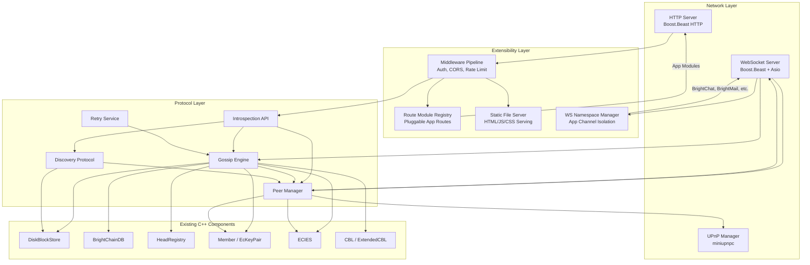
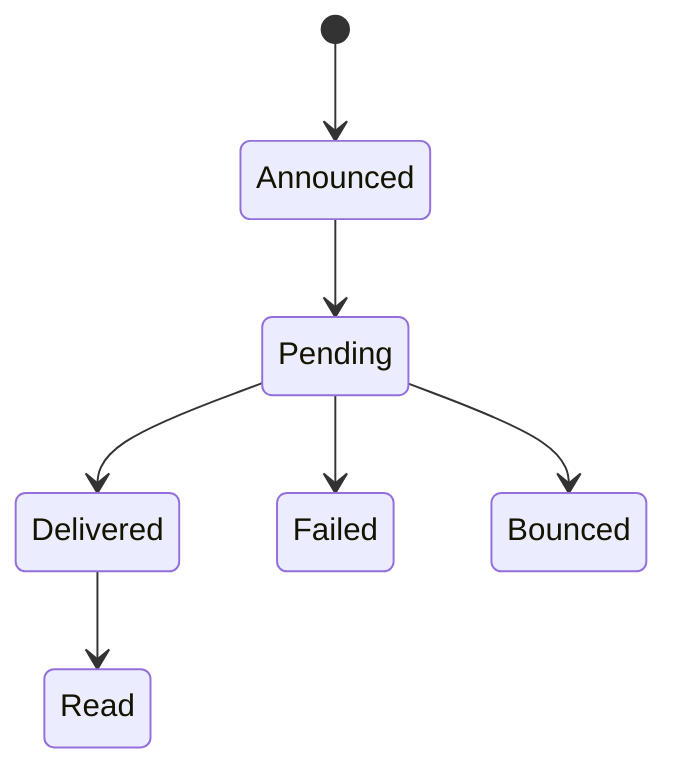

# Design Document: C++ Gossip Protocol

## Overview

This design specifies the C++ implementation of the BrightChain gossip protocol, enabling C++ nodes to participate as full peers in the BrightChain network. The implementation must be wire-compatible with the existing TypeScript implementation so that mixed-language networks operate seamlessly.

The gossip protocol uses epidemic-style propagation: each node forwards block announcements to a random subset of peers (fanout), decrementing a TTL counter at each hop. This achieves O(log N) delivery latency across the network without centralized coordination.

Key subsystems:
- **Gossip Engine** — core announcement creation, batching, forwarding, and validation
- **Peer Manager** — peer discovery, WebSocket connections, ECIES authentication, heartbeats
- **Discovery Protocol** — Bloom filter-based block location with caching and latency sorting
- **Retry Service** — exponential backoff retries for unacknowledged message deliveries
- **WebSocket Server** — node-to-node (ECIES auth), client (JWT auth), and namespaced app channels
- **HTTP Server** — pluggable route modules, static file serving, modular middleware pipeline
- **REST Introspection API** — status, peers, pools, stats endpoints for monitoring
- **UPnP Manager** — NAT traversal via UPnP/NAT-PMP port mapping

The server is designed as a future-forward application server: web applications like BrightChat, BrightMail, and BrightHub can register their own HTTP route modules, serve static frontends, use namespaced WebSocket channels for real-time events, and leverage a composable middleware pipeline for auth, CORS, and rate limiting.

All components integrate with the existing C++ codebase: `DiskBlockStore`, `BrightChainDB`, `HeadRegistry`, `Member`, `ECIES`, `EcKeyPair`, `CBL`, and `ExtendedCBL`.

## Architecture



### Threading Model

All network I/O runs on a `boost::asio::io_context` thread pool. The gossip engine's batch timer, retry service timer, and heartbeat timer are all `boost::asio::steady_timer` instances running on the same io_context. Shared state (peer registry, pending announcements, discovery cache) is protected by `std::shared_mutex` for concurrent read access with exclusive writes.

### Dependency Choices

| Concern | Library | Rationale |
|---------|---------|-----------|
| Async I/O | Boost.Asio | Industry standard for C++ async networking |
| WebSocket + HTTP | Boost.Beast | Built on Asio, supports both WS and HTTP |
| JSON | nlohmann/json (existing) | Already in the project |
| JWT | jwt-cpp | Header-only, well-maintained, supports RS256/HS256 |
| UPnP | miniupnpc | Widely used C library, supports UPnP + NAT-PMP |
| Bloom filter | Custom header-only | Simple implementation using existing SHA3 |
| Property testing | RapidCheck | Mature C++ property-based testing library |

## Components and Interfaces

### 1. BlockAnnouncement

The core message type propagated through the gossip network. Must be JSON-serializable with identical field names to the TypeScript `BlockAnnouncement` interface.

```cpp
namespace brightchain::gossip {

enum class AnnouncementType : uint8_t {
    Add, Remove, Ack,
    PoolDeleted, CblIndexUpdate, CblIndexDelete,
    HeadUpdate, AclUpdate,
    PoolAnnounce, PoolRemove,
    QuorumProposal, QuorumVote
};

struct MessageDeliveryMetadata {
    std::string messageId;
    std::vector<std::string> recipientIds;
    std::string priority; // "normal" | "high"
    std::vector<std::string> blockIds;
    std::string cblBlockId;
    bool ackRequired;
    bool gatewayOutbound = false;
};

struct DeliveryAckMetadata {
    std::string messageId;
    std::string recipientId;
    std::string status; // "delivered" | "read" | "failed" | "bounced"
    std::string originalSenderNode;
};

struct HeadUpdateMetadata {
    std::string dbName;
    std::string collectionName;
};

struct PoolAnnouncementMetadata {
    int64_t blockCount;
    int64_t totalSize;
    bool encrypted;
    std::optional<std::string> encryptedMetadata; // base64 ECIES
};

struct QuorumProposalMetadata {
    std::string proposalId;
    std::string description; // max 4096 chars
    std::string actionType;
    std::string actionPayload;
    std::string proposerMemberId;
    std::string expiresAt; // ISO 8601
    int requiredThreshold; // >= 1
    std::optional<std::string> attachmentCblId;
};

struct QuorumVoteMetadata {
    std::string proposalId;
    std::string voterMemberId;
    std::string decision; // "approve" | "reject"
    std::optional<std::string> comment; // max 1024 chars
    std::optional<std::vector<uint8_t>> encryptedShare;
};

struct WriteProof {
    std::string signerPublicKey; // hex
    std::string signature;       // hex
    std::string dbName;
    std::string collectionName;
    std::string blockId;
};

struct CblIndexEntry {
    std::string magnetUrl;
    std::string blockId1;
    std::string blockId2;
    // additional fields as needed
};

struct BlockAnnouncement {
    AnnouncementType type;
    std::string blockId;
    std::string nodeId;
    std::string timestamp; // ISO 8601
    int ttl;

    std::optional<MessageDeliveryMetadata> messageDelivery;
    std::optional<DeliveryAckMetadata> deliveryAck;
    std::optional<std::string> poolId;
    std::optional<CblIndexEntry> cblIndexEntry;
    std::optional<HeadUpdateMetadata> headUpdate;
    std::optional<std::string> aclBlockId;
    std::optional<PoolAnnouncementMetadata> poolAnnouncement;
    std::optional<QuorumProposalMetadata> quorumProposal;
    std::optional<QuorumVoteMetadata> quorumVote;
    std::optional<WriteProof> writeProof;

    // Serialize to JSON (wire-compatible with TypeScript)
    nlohmann::json toJson() const;
    // Deserialize from JSON
    static BlockAnnouncement fromJson(const nlohmann::json& j);
    // Validate all fields according to type
    bool validate() const;
};

} // namespace brightchain::gossip
```

### 2. GossipConfig

```cpp
namespace brightchain::gossip {

struct PriorityGossipConfig {
    int fanout;
    int ttl;
};

struct GossipConfig {
    int fanout = 3;
    int defaultTtl = 3;
    int batchIntervalMs = 1000;
    int maxBatchSize = 100;
    struct {
        PriorityGossipConfig normal{5, 5};
        PriorityGossipConfig high{7, 7};
    } messagePriority;

    nlohmann::json toJson() const;
    static GossipConfig fromJson(const nlohmann::json& j);
    static bool validate(const GossipConfig& config);
};

} // namespace brightchain::gossip
```

### 3. GossipEngine

```cpp
namespace brightchain::gossip {

using AnnouncementHandler = std::function<void(const BlockAnnouncement&)>;

class GossipEngine {
public:
    GossipEngine(
        PeerManager& peerManager,
        DiskBlockStore& blockStore,
        db::HeadRegistry& headRegistry,
        const Member& localNode,
        GossipConfig config = {}
    );

    // Block announcements
    void announceBlock(const std::string& blockId, std::optional<std::string> poolId = {});
    void announceRemoval(const std::string& blockId, std::optional<std::string> poolId = {});

    // Message delivery
    void announceMessage(const std::vector<std::string>& blockIds, const MessageDeliveryMetadata& metadata);
    void sendDeliveryAck(const DeliveryAckMetadata& ack);

    // Head registry sync
    void announceHeadUpdate(const std::string& dbName, const std::string& collectionName,
                            const std::string& blockId, std::optional<WriteProof> proof = {});

    // Pool lifecycle
    void announcePoolCreation(const std::string& poolId, const PoolAnnouncementMetadata& meta);
    void announcePoolRemoval(const std::string& poolId);
    void announcePoolDeletion(const std::string& poolId);

    // Quorum
    void announceQuorumProposal(const QuorumProposalMetadata& meta);
    void announceQuorumVote(const QuorumVoteMetadata& meta);

    // CBL index
    void announceCblIndexUpdate(const std::string& poolId, const CblIndexEntry& entry);
    void announceCblIndexDelete(const std::string& poolId, const CblIndexEntry& entry);

    // ACL
    void announceAclUpdate(const std::string& poolId, const std::string& aclBlockId);

    // Incoming announcement processing
    void handleAnnouncement(const BlockAnnouncement& announcement);

    // Event subscriptions
    void onAnnouncement(AnnouncementHandler handler);
    void onMessageDelivery(AnnouncementHandler handler);
    void onDeliveryAck(AnnouncementHandler handler);
    void onQuorumProposal(AnnouncementHandler handler);
    void onQuorumVote(AnnouncementHandler handler);

    // Lifecycle
    void start(boost::asio::io_context& ioc);
    void stop();
    void flushAnnouncements();

    // Inspection
    std::vector<BlockAnnouncement> getPendingAnnouncements() const;
    const GossipConfig& getConfig() const;

private:
    void queueAnnouncement(BlockAnnouncement announcement);
    void batchFlush();
    void forwardAnnouncement(const BlockAnnouncement& announcement);
    std::vector<std::string> selectRandomPeers(int count);
    void encryptAndSendBatch(const std::string& peerId,
                             const std::vector<BlockAnnouncement>& batch);

    PeerManager& peerManager_;
    DiskBlockStore& blockStore_;
    db::HeadRegistry& headRegistry_;
    Member localNode_;
    GossipConfig config_;

    mutable std::shared_mutex announcementMutex_;
    std::vector<BlockAnnouncement> pendingAnnouncements_;
    std::unique_ptr<boost::asio::steady_timer> batchTimer_;

    std::vector<AnnouncementHandler> announcementHandlers_;
    std::vector<AnnouncementHandler> messageDeliveryHandlers_;
    std::vector<AnnouncementHandler> deliveryAckHandlers_;
    std::vector<AnnouncementHandler> quorumProposalHandlers_;
    std::vector<AnnouncementHandler> quorumVoteHandlers_;

    std::set<std::string> localUserIds_;
};

} // namespace brightchain::gossip
```

### 4. PeerManager

```cpp
namespace brightchain::gossip {

struct PeerInfo {
    std::string nodeId;
    std::string address;
    uint16_t httpPort;
    uint16_t wsPort;
    std::string lastSeen; // ISO 8601
    std::vector<std::string> capabilities;
    bool connected = false;
    double latencyMs = 0.0;
    std::vector<uint8_t> publicKey; // 33-byte compressed secp256k1
};

class PeerManager {
public:
    PeerManager(boost::asio::io_context& ioc, const Member& localNode);

    // Discovery
    void addBootstrapNodes(const std::vector<std::string>& addresses);
    void startDiscovery();

    // Connection management
    void connectToPeer(const std::string& address, uint16_t wsPort);
    void disconnectPeer(const std::string& nodeId);

    // Peer registry
    std::vector<PeerInfo> getConnectedPeers() const;
    std::optional<PeerInfo> getPeer(const std::string& nodeId) const;
    std::vector<std::string> getConnectedPeerIds() const;

    // Messaging
    void sendToPeer(const std::string& nodeId, const std::string& message);
    void broadcastToPeers(const std::vector<std::string>& peerIds, const std::string& message);

    // Pool discovery cache
    void updatePoolCache(const std::string& poolId, const PoolAnnouncementMetadata& meta,
                         const std::string& hostNodeId);
    void removePoolFromCache(const std::string& poolId);

    // Lifecycle
    void start();
    void stop();

private:
    void authenticateConnection(/* ws session, peer public key */);
    void handleHeartbeat();
    void reconnectWithBackoff(const std::string& nodeId);

    boost::asio::io_context& ioc_;
    Member localNode_;
    mutable std::shared_mutex peerMutex_;
    std::unordered_map<std::string, PeerInfo> peers_;
    // WebSocket sessions managed internally
};

} // namespace brightchain::gossip
```

### 5. DiscoveryProtocol

```cpp
namespace brightchain::gossip {

struct DiscoveryConfig {
    int queryTimeoutMs = 5000;
    int maxConcurrentQueries = 10;
    int cacheTtlMs = 60000;
    double bloomFilterFalsePositiveRate = 0.01;
    int bloomFilterHashCount = 7;
};

struct LocationRecord {
    std::string nodeId;
    double latencyMs;
};

struct DiscoveryResult {
    std::string blockId;
    bool found;
    std::vector<LocationRecord> locations; // sorted by latency
    int queriedPeers;
    int durationMs;
    std::optional<std::string> poolId;
};

class BloomFilter {
public:
    BloomFilter(size_t expectedItems, double falsePositiveRate, int hashCount);
    void add(const std::string& item);
    bool mightContain(const std::string& item) const;
    std::vector<uint8_t> serialize() const;
    static BloomFilter deserialize(const std::vector<uint8_t>& data);
private:
    std::vector<bool> bits_;
    int hashCount_;
    size_t size_;
};

class DiscoveryProtocol {
public:
    DiscoveryProtocol(PeerManager& peerManager, DiskBlockStore& blockStore,
                      DiscoveryConfig config = {});

    DiscoveryResult discoverBlock(const std::string& blockId,
                                  std::optional<std::string> poolId = {});
    std::optional<std::vector<LocationRecord>> getCachedLocations(const std::string& blockId);
    void clearCache(const std::string& blockId);
    void clearAllCache();
    BloomFilter getLocalBloomFilter() const;
    const DiscoveryConfig& getConfig() const;

    // CBL metadata search
    struct CblSearchResult {
        std::vector<CblIndexEntry> hits;
        int queriedPeers;
        int durationMs;
    };
    CblSearchResult searchCblMetadata(const std::string& fileName = "",
                                       const std::string& mimeType = "",
                                       const std::vector<std::string>& tags = {},
                                       std::optional<std::string> poolId = {});

private:
    PeerManager& peerManager_;
    DiskBlockStore& blockStore_;
    DiscoveryConfig config_;

    mutable std::shared_mutex cacheMutex_;
    struct CacheEntry {
        std::vector<LocationRecord> locations;
        std::chrono::steady_clock::time_point expiresAt;
    };
    std::unordered_map<std::string, CacheEntry> cache_;
};

} // namespace brightchain::gossip
```

### 6. RetryService

```cpp
namespace brightchain::gossip {

enum class DeliveryStatus : uint8_t {
    Announced, Pending, Delivered, Read, Failed, Bounced
};

struct RetryConfig {
    int initialTimeoutMs = 30000;
    int backoffMultiplier = 2;
    int maxRetries = 5;
    int maxBackoffMs = 240000;
};

struct PendingDelivery {
    std::string messageId;
    std::vector<std::string> blockIds;
    MessageDeliveryMetadata metadata;
    std::unordered_map<std::string, DeliveryStatus> recipientStatuses;
    int retryCount = 0;
    std::chrono::steady_clock::time_point nextRetryAt;
    std::chrono::steady_clock::time_point createdAt;
};

class RetryService {
public:
    RetryService(GossipEngine& engine, RetryConfig config = {});

    void trackDelivery(const std::string& messageId,
                       const std::vector<std::string>& blockIds,
                       const MessageDeliveryMetadata& metadata);
    void handleAck(const DeliveryAckMetadata& ack);
    void checkRetries(); // public for testing
    void start(boost::asio::io_context& ioc);
    void stop();

    std::optional<PendingDelivery> getPendingDelivery(const std::string& messageId) const;
    size_t getPendingCount() const;
    const RetryConfig& getConfig() const;

    // Callback for failed deliveries
    using FailureHandler = std::function<void(const std::string& messageId,
                                              const std::vector<std::string>& failedRecipients)>;
    void onDeliveryFailed(FailureHandler handler);

private:
    int calculateBackoff(int retryCount) const;
    bool validateTransition(DeliveryStatus from, DeliveryStatus to) const;

    GossipEngine& engine_;
    RetryConfig config_;
    mutable std::shared_mutex deliveryMutex_;
    std::unordered_map<std::string, PendingDelivery> pendingDeliveries_;
    std::unique_ptr<boost::asio::steady_timer> retryTimer_;
    std::vector<FailureHandler> failureHandlers_;
};

} // namespace brightchain::gossip
```

### 7. WebSocketServer

```cpp
namespace brightchain::gossip {

class WebSocketServer {
public:
    WebSocketServer(boost::asio::io_context& ioc, GossipEngine& engine,
                    PeerManager& peerManager, const Member& localNode,
                    const std::string& jwtSecret);

    void start(const std::string& address, uint16_t port);
    void stop();

    // Node-to-node: /ws/node/:nodeId with ECIES auth
    // Client: /ws/client?token=<jwt> with JWT auth

private:
    void handleNodeConnection(/* session */);
    void handleClientConnection(/* session */);
    bool authenticateEcies(/* challenge/response */);
    bool authenticateJwt(const std::string& token);
    void sendPing(/* session */);
    void handlePong(/* session */);

    boost::asio::io_context& ioc_;
    GossipEngine& engine_;
    PeerManager& peerManager_;
    Member localNode_;
    std::string jwtSecret_;
};

} // namespace brightchain::gossip
```

### 8. REST Introspection API

```cpp
namespace brightchain::gossip {

class IntrospectionApi {
public:
    IntrospectionApi(GossipEngine& engine, PeerManager& peerManager,
                     DiskBlockStore& blockStore, DiscoveryProtocol& discovery,
                     const std::string& jwtSecret);

    // Registers routes on the HTTP server
    void registerRoutes(/* beast http server */);

private:
    // GET /api/introspection/status
    void handleStatus(/* request, response */);
    // GET /api/introspection/peers (Admin only)
    void handlePeers(/* request, response */);
    // GET /api/introspection/pools
    void handlePools(/* request, response */);
    // GET /api/introspection/stats (Admin only)
    void handleStats(/* request, response */);
    // POST /api/introspection/discover-pools
    void handleDiscoverPools(/* request, response */);

    bool validateJwt(const std::string& token, MemberType& outType);
    bool requireAdmin(MemberType type);
};

} // namespace brightchain::gossip
```

### 9. UPnP Manager

```cpp
namespace brightchain::gossip {

struct UpnpConfig {
    bool enabled = false;
    uint16_t httpPort = 3000;
    uint16_t websocketPort = 3000;
    int ttlSeconds = 3600;
    int refreshIntervalMs = 1800000;
    int retryAttempts = 3;
    int retryDelayMs = 5000;
};

class UpnpManager {
public:
    explicit UpnpManager(const UpnpConfig& config);

    void initialize(); // discover external IP, create mappings
    void shutdown();    // remove all mappings

    std::optional<std::string> getExternalIp() const;
    uint16_t getMappedHttpPort() const;
    uint16_t getMappedWsPort() const;

private:
    void createMapping(uint16_t internalPort, uint16_t externalPort, const std::string& desc);
    void removeAllMappings();
    void refreshMappings();

    UpnpConfig config_;
    std::string externalIp_;
    bool initialized_ = false;
};

} // namespace brightchain::gossip
```

## Data Models

### BlockAnnouncement JSON Wire Format

The JSON serialization must match the TypeScript `BlockAnnouncement` interface exactly. The `type` field is serialized as a lowercase string matching the TypeScript union type values.

```json
{
  "type": "add",
  "blockId": "a1b2c3...",
  "nodeId": "node-uuid",
  "timestamp": "2025-01-28T12:00:00.000Z",
  "ttl": 3,
  "messageDelivery": {
    "messageId": "msg-uuid",
    "recipientIds": ["user-1", "user-2"],
    "priority": "normal",
    "blockIds": ["block-1", "block-2"],
    "cblBlockId": "cbl-block-id",
    "ackRequired": true
  },
  "poolId": "pool-uuid",
  "poolAnnouncement": {
    "blockCount": 1024,
    "totalSize": 1073741824,
    "encrypted": true,
    "encryptedMetadata": "base64..."
  },
  "quorumProposal": {
    "proposalId": "hex-string",
    "description": "Proposal text",
    "actionType": "AddMember",
    "actionPayload": "{}",
    "proposerMemberId": "hex-string",
    "expiresAt": "2025-02-28T12:00:00.000Z",
    "requiredThreshold": 3
  },
  "quorumVote": {
    "proposalId": "hex-string",
    "voterMemberId": "hex-string",
    "decision": "approve",
    "comment": "I agree",
    "encryptedShare": [1, 2, 3]
  },
  "writeProof": {
    "signerPublicKey": "hex",
    "signature": "hex",
    "dbName": "brightchain",
    "collectionName": "users",
    "blockId": "hex"
  }
}
```

Optional fields are omitted from JSON when not present (not set to null). The `timestamp` field uses ISO 8601 format with millisecond precision. The `encryptedShare` in `quorumVote` is serialized as a JSON array of integers (matching TypeScript `Uint8Array` JSON serialization).

### AnnouncementType String Mapping

| C++ Enum | JSON String |
|----------|-------------|
| `Add` | `"add"` |
| `Remove` | `"remove"` |
| `Ack` | `"ack"` |
| `PoolDeleted` | `"pool_deleted"` |
| `CblIndexUpdate` | `"cbl_index_update"` |
| `CblIndexDelete` | `"cbl_index_delete"` |
| `HeadUpdate` | `"head_update"` |
| `AclUpdate` | `"acl_update"` |
| `PoolAnnounce` | `"pool_announce"` |
| `PoolRemove` | `"pool_remove"` |
| `QuorumProposal` | `"quorum_proposal"` |
| `QuorumVote` | `"quorum_vote"` |

### GossipConfig JSON Wire Format

```json
{
  "fanout": 3,
  "defaultTtl": 3,
  "batchIntervalMs": 1000,
  "maxBatchSize": 100,
  "messagePriority": {
    "normal": { "fanout": 5, "ttl": 5 },
    "high": { "fanout": 7, "ttl": 7 }
  }
}
```

### Delivery Status State Machine



Only valid transitions are permitted. Invalid transitions (e.g., `Failed → Delivered`) are rejected silently.

### Bloom Filter Serialization

The Bloom filter is serialized as a binary blob: a 4-byte little-endian size prefix followed by the bit array packed into bytes. The hash count and expected item count are transmitted separately in the protocol handshake. Hash functions use SHA3-512 truncated to different offsets within the digest to produce `hashCount` independent hash values.

### Peer Registry Data

```json
{
  "nodeId": "uuid",
  "address": "192.168.1.100",
  "httpPort": 3000,
  "wsPort": 3000,
  "lastSeen": "2025-01-28T12:00:00.000Z",
  "capabilities": ["blocks", "pools", "gossip"],
  "connected": true,
  "latencyMs": 42.5,
  "publicKey": "hex-encoded-33-bytes"
}
```

### REST API Response Envelope

All REST responses follow the TypeScript `IApiMessageResponse` pattern:

```json
{
  "message": "Success",
  "data": { ... }
}
```

Error responses:

```json
{
  "message": "Unauthorized",
  "error": "Token expired"
}
```

### File Layout

New files follow existing project conventions:

```
include/brightchain/
    gossip/
        block_announcement.hpp
        gossip_config.hpp
        gossip_engine.hpp
        peer_manager.hpp
        discovery_protocol.hpp
        retry_service.hpp
        bloom_filter.hpp
        websocket_server.hpp
        introspection_api.hpp
        upnp_manager.hpp
src/
    gossip/
        block_announcement.cpp
        gossip_config.cpp
        gossip_engine.cpp
        peer_manager.cpp
        discovery_protocol.cpp
        retry_service.cpp
        bloom_filter.cpp
        websocket_server.cpp
        introspection_api.cpp
        upnp_manager.cpp
tests/
    gossip/
        block_announcement_test.cpp
        gossip_engine_test.cpp
        peer_manager_test.cpp
        discovery_protocol_test.cpp
        retry_service_test.cpp
        bloom_filter_test.cpp
        websocket_server_test.cpp
        introspection_api_test.cpp
        upnp_manager_test.cpp
```

### CMake Integration

A new `gossip` subdirectory is added to both `src/CMakeLists.txt` and `tests/CMakeLists.txt`. New vcpkg dependencies:

```json
{
  "dependencies": [
    "boost-beast",
    "boost-asio",
    "jwt-cpp",
    "miniupnpc"
  ]
}
```

The gossip library links against the existing `brightchain` library target plus the new Boost and miniupnpc dependencies.


## Correctness Properties

*A property is a characteristic or behavior that should hold true across all valid executions of a system — essentially, a formal statement about what the system should do. Properties serve as the bridge between human-readable specifications and machine-verifiable correctness guarantees.*

### Property 1: BlockAnnouncement JSON round-trip

*For any* valid `BlockAnnouncement` of any of the 12 types, serializing to JSON via `toJson()` then deserializing via `fromJson()` shall produce a `BlockAnnouncement` that is equivalent to the original (all fields match, optional fields preserved or absent identically).

**Validates: Requirements 1.10, 1.11, 1.12, 14.1, 14.6**

### Property 2: GossipConfig validation

*For any* `GossipConfig`, `validate()` returns true if and only if `fanout >= 1`, `defaultTtl >= 1`, `messagePriority.normal.fanout >= 1`, `messagePriority.normal.ttl >= 1`, `messagePriority.high.fanout >= 1`, and `messagePriority.high.ttl >= 1` (all positive integers).

**Validates: Requirements 1.8, 1.9**

### Property 3: GossipConfig JSON round-trip

*For any* valid `GossipConfig`, serializing to JSON via `toJson()` then deserializing via `fromJson()` shall produce an equivalent `GossipConfig` with identical field names and values.

**Validates: Requirements 14.2**

### Property 4: BlockAnnouncement type-specific validation

*For any* `BlockAnnouncement`, `validate()` returns true if and only if: (a) `messageDelivery` is present only when `type == add`, (b) `deliveryAck` is present only when `type == ack`, (c) `pool_deleted` has a valid `poolId` and no `messageDelivery`/`deliveryAck`, (d) `cbl_index_update`/`cbl_index_delete` have valid `poolId` and `cblIndexEntry` with non-empty `magnetUrl`, `blockId1`, `blockId2`, (e) `head_update` has non-empty `blockId` and `headUpdate` with non-empty `dbName`/`collectionName`, (f) `acl_update` has valid `poolId` and non-empty `aclBlockId`, (g) `pool_announce` has valid `poolId` and `poolAnnouncement` with numeric `blockCount`/`totalSize` and boolean `encrypted`, (h) `quorum_proposal` has `quorumProposal` with non-empty `proposalId`, `description` <= 4096 chars, non-empty `proposerMemberId`, `requiredThreshold >= 1`, (i) `quorum_vote` has `quorumVote` with non-empty `proposalId`/`voterMemberId`, `decision` in {approve, reject}, optional `comment` <= 1024 chars.

**Validates: Requirements 2.1, 2.2, 2.3, 2.4, 2.5, 2.6, 2.7, 2.8, 2.9, 2.10**

### Property 5: TTL decrement and fanout count on forward

*For any* `BlockAnnouncement` with `ttl > 0` and any set of connected peers of size `N >= fanout`, forwarding the announcement shall produce a new announcement with `ttl` decremented by exactly 1, sent to exactly `min(fanout, N)` distinct peers.

**Validates: Requirements 1.3**

### Property 6: Batch size enforcement

*For any* sequence of queued announcements of length `L > maxBatchSize`, flushing shall produce batches where each batch contains at most `maxBatchSize` announcements and the total across all batches equals `L`.

**Validates: Requirements 1.6**

### Property 7: Priority-based fanout and TTL assignment

*For any* message announcement with priority `p` and `GossipConfig` `c`, the created `BlockAnnouncement` shall have `ttl == c.messagePriority[p].ttl` and be forwarded to `c.messagePriority[p].fanout` peers. For block-level announcements (non-message), `ttl == c.defaultTtl` and fanout equals `c.fanout`.

**Validates: Requirements 1.2, 5.2, 5.3**

### Property 8: Local recipient matching determines forwarding behavior

*For any* message announcement with `recipientIds` and a set of `localUserIds`, the announcement is delivered locally (handlers triggered, not forwarded) if and only if the intersection of `recipientIds` and `localUserIds` is non-empty. Otherwise, the announcement is forwarded with decremented TTL.

**Validates: Requirements 5.4, 5.5**

### Property 9: Auto-ack on delivery with ackRequired

*For any* message announcement delivered to a local recipient where `ackRequired == true`, the engine shall queue exactly one `ack`-type `BlockAnnouncement` with `DeliveryAckMetadata` containing the correct `messageId`, `recipientId`, `status == "delivered"`, and `originalSenderNode`.

**Validates: Requirements 5.6**

### Property 10: Sensitive batch ECIES encryption round-trip

*For any* batch of `BlockAnnouncement` objects containing `messageDelivery` or `deliveryAck` metadata, and any peer with a known public key, encrypting the batch with ECIES using the peer's public key then decrypting with the peer's private key shall produce the original batch.

**Validates: Requirements 5.7**

### Property 11: Retry backoff calculation with cap

*For any* `RetryConfig` with `initialTimeoutMs`, `backoffMultiplier`, and `maxBackoffMs`, and any retry count `n >= 1`, the computed backoff delay shall equal `min(initialTimeoutMs * backoffMultiplier^(n-1), maxBackoffMs)`.

**Validates: Requirements 6.2, 6.3**

### Property 12: Delivery status state machine transitions

*For any* pair of `DeliveryStatus` values `(from, to)`, the transition is valid if and only if it matches one of: `Announced → Pending`, `Pending → Delivered`, `Pending → Failed`, `Pending → Bounced`, `Delivered → Read`. All other transitions shall be rejected.

**Validates: Requirements 6.8**

### Property 13: Retry exhaustion marks recipients as Failed

*For any* `PendingDelivery` where `retryCount >= maxRetries`, all recipients with status `Announced` or `Pending` shall be transitioned to `Failed`, and the delivery shall be removed from tracking.

**Validates: Requirements 6.4, 6.6**

### Property 14: Ack removes fully-delivered from tracking

*For any* `PendingDelivery` where every recipient's status is `Delivered` or `Read`, the delivery shall be removed from the pending tracking map.

**Validates: Requirements 6.5**

### Property 15: Initial tracking sets Announced status

*For any* newly tracked delivery with `N` recipients, all `N` recipients shall have status `Announced`, and `nextRetryAt` shall equal `createdAt + initialTimeoutMs`.

**Validates: Requirements 6.1**

### Property 16: Head update announcement creation

*For any* HeadRegistry update with `dbName`, `collectionName`, and `blockId`, the created `BlockAnnouncement` shall have `type == head_update`, the `blockId` field set to the new block ID, and `headUpdate` metadata with the correct `dbName` and `collectionName`.

**Validates: Requirements 7.1**

### Property 17: Head update signature verification

*For any* `head_update` announcement with a `writeProof`, the announcement shall be accepted if and only if the signature in `writeProof` is a valid ECDSA signature over the concatenation of `dbName + collectionName + blockId` using the public key in `signerPublicKey`.

**Validates: Requirements 7.3**

### Property 18: Pool cache reflects announcements

*For any* `pool_announce` announcement received, the pool discovery cache shall contain the pool with the announced metadata. *For any* `pool_deleted` announcement received, the pool shall be absent from the cache.

**Validates: Requirements 8.3, 8.4**

### Property 19: Encrypted pool metadata in announcements

*For any* pool with `encrypted == true`, the `pool_announce` announcement shall include a non-empty `encryptedMetadata` field that, when decrypted with an authorized member's private key, yields the pool details.

**Validates: Requirements 8.5**

### Property 20: Quorum announcements use high-priority config

*For any* `quorum_proposal` or `quorum_vote` announcement, the TTL and fanout shall match the `messagePriority.high` configuration values.

**Validates: Requirements 9.1, 9.2**

### Property 21: Encrypted share preservation in approve votes

*For any* `quorum_vote` announcement with `decision == "approve"` and a non-empty `encryptedShare`, the `encryptedShare` bytes shall be preserved exactly through serialization, transmission, and deserialization.

**Validates: Requirements 9.5**

### Property 22: WebSocket event access tier filtering

*For any* WebSocket event with access tier `T` and any connected client with `MemberType M`, the event is delivered to the client if and only if: (a) `T == Admin` implies `M` is Admin or System, (b) `T == Pool-Scoped` implies the client has Read permission on the target pool, (c) `T == Member-Scoped` implies the client is the target member.

**Validates: Requirements 10.5**

### Property 23: REST admin access control

*For any* REST endpoint marked as Admin-restricted and any request with a valid JWT for member type `M`, the response status is 200 (success) if `M` is Admin or System, and 403 (Forbidden) if `M` is User or Anonymous.

**Validates: Requirements 11.2, 11.4, 11.7**

### Property 24: REST JWT authentication

*For any* REST introspection endpoint and any request, the response status is 401 if the Authorization header is missing, contains an expired token, or contains a malformed token.

**Validates: Requirements 11.6**

### Property 25: REST pool filtering by permissions

*For any* request to GET /api/introspection/pools by a member with Read permissions on a subset `S` of all pools, the response shall contain exactly the pools in `S` (plus all pools if the member is Admin/System).

**Validates: Requirements 11.3**

### Property 26: Bloom filter membership

*For any* set of block IDs added to a Bloom filter, `mightContain(blockId)` shall return `true` for every added block ID (no false negatives).

**Validates: Requirements 4.1**

### Property 27: Discovery results sorted by latency

*For any* `DiscoveryResult` with `locations` of length `L >= 2`, for all `i` in `[0, L-2]`, `locations[i].latencyMs <= locations[i+1].latencyMs`.

**Validates: Requirements 4.5**

### Property 28: Bloom filter pre-check filtering

*For any* set of peers and a target block ID, the Discovery Protocol shall only send direct queries to peers whose Bloom filter returns `mightContain(blockId) == true`. Peers whose filter returns `false` shall not be queried.

**Validates: Requirements 4.3**

### Property 29: Peer registry completeness

*For any* peer added to the PeerManager, retrieving the peer by `nodeId` shall return a `PeerInfo` with all required fields populated: `nodeId`, `address`, `httpPort`, `wsPort`, `lastSeen`, `capabilities`, and `connected` status.

**Validates: Requirements 3.2**

### Property 30: ECIES challenge/response round-trip

*For any* EcKeyPair, encrypting a random challenge with the public key using ECIES then decrypting with the private key shall produce the original challenge bytes. This validates the authentication protocol used for node-to-node WebSocket connections.

**Validates: Requirements 3.4, 14.5**

### Property 31: Peer reconnection backoff

*For any* reconnection attempt number `n >= 0`, the reconnection delay shall equal `min(1 * 2^n, 60)` seconds.

**Validates: Requirements 3.5**

### Property 32: UPnP refresh interval less than TTL

*For any* valid `UpnpConfig`, `refreshIntervalMs < ttlSeconds * 1000` must hold. Configurations violating this constraint shall be rejected.

**Validates: Requirements 12.3**

### Property 33: UPnP retry backoff

*For any* UPnP port mapping retry attempt number `n` (0-indexed) up to `retryAttempts`, the retry delay shall follow exponential backoff: `retryDelayMs * 2^n`.

**Validates: Requirements 12.4**

## Error Handling

### Gossip Engine Errors

| Error Condition | Handling |
|----------------|----------|
| Invalid GossipConfig | Throw `InvalidGossipConfigError` with descriptive message listing which fields are invalid |
| Invalid BlockAnnouncement received | Log warning with announcement type and validation failure reason; discard silently; do not forward |
| JSON deserialization failure | Log warning with parse error; discard the message |
| Peer unreachable during batch send | Log warning; skip peer; announcement will be retried via gossip redundancy |
| ECIES encryption failure (missing peer key) | Fall back to plaintext; log warning |
| Batch flush failure | Log error; announcements remain in queue for next flush cycle |

### Peer Manager Errors

| Error Condition | Handling |
|----------------|----------|
| WebSocket connection failure | Log warning; schedule reconnection with exponential backoff (1s base, 60s cap) |
| ECIES authentication failure | Close connection; log warning with peer nodeId; do not add to peer registry |
| Heartbeat timeout | Mark peer as disconnected; trigger reconnection backoff |
| DNS seed query failure | Log warning; continue with other discovery mechanisms |
| Multicast discovery failure | Log warning; continue with bootstrap nodes |

### Discovery Protocol Errors

| Error Condition | Handling |
|----------------|----------|
| Peer query timeout | Record timeout in result; continue with remaining peers |
| Bloom filter deserialization failure | Skip peer; log warning |
| All peers unreachable | Return `DiscoveryResult` with `found == false` and empty `locations` |
| Cache corruption | Clear cache entry; re-query network |

### Retry Service Errors

| Error Condition | Handling |
|----------------|----------|
| Re-announcement failure | Log error; increment retry count; will retry on next check cycle |
| Invalid status transition | Reject silently; log debug message |
| Metadata store update failure | Log error; in-memory state already updated; continue |
| Max retries exhausted | Mark unacked recipients as Failed; emit failure event; remove from tracking |

### WebSocket Server Errors

| Error Condition | Handling |
|----------------|----------|
| JWT validation failure on connect | Reject connection with close code 4001 |
| JWT expiry during session | Send `auth:token_expiring` event; close with code 4002 after grace period |
| Malformed WebSocket message | Log warning; ignore message |
| Pong timeout | Close connection; mark peer as disconnected |

### REST API Errors

| Error Condition | Handling |
|----------------|----------|
| Missing/expired JWT | Return HTTP 401 with `{"message": "Unauthorized"}` |
| Insufficient permissions | Return HTTP 403 with `{"message": "Forbidden"}` |
| Pool not found | Return HTTP 404 with `{"message": "Not Found"}` |
| Internal error | Return HTTP 500 with `{"message": "Internal Server Error"}`; log full error |

### UPnP Manager Errors

| Error Condition | Handling |
|----------------|----------|
| UPnP device not found | Log warning with manual port forwarding instructions; continue startup (non-fatal) |
| Port mapping creation failure | Retry with exponential backoff up to `retryAttempts`; if exhausted, log error and continue |
| Refresh failure | Exponential backoff on refresh timer; recreate mappings if count drops |
| Shutdown cleanup failure | Best-effort removal; mappings expire naturally after TTL |

## Testing Strategy

### Dual Testing Approach

This feature requires both unit tests and property-based tests for comprehensive coverage:

- **Unit tests** (Google Test): Verify specific examples, edge cases, error conditions, and integration points
- **Property-based tests** (RapidCheck with Google Test): Verify universal properties across randomly generated inputs

### Property-Based Testing Configuration

- Library: **RapidCheck** (`rapidcheck` — C++ property-based testing library, integrates with Google Test)
- Minimum **100 iterations** per property test (RapidCheck default is 100, configurable via `RC_PARAMS`)
- Each property test must reference its design document property with a tag comment:
  ```cpp
  // Feature: cpp-gossip-protocol, Property 1: BlockAnnouncement JSON round-trip
  ```
- Each correctness property is implemented by a **single** property-based test
- Custom generators for `BlockAnnouncement`, `GossipConfig`, `MessageDeliveryMetadata`, `DeliveryAckMetadata`, `QuorumProposalMetadata`, `QuorumVoteMetadata`, `PeerInfo`, `RetryConfig`, `UpnpConfig`, and `DeliveryStatus`

### Unit Test Coverage

Unit tests focus on:

- **Specific examples**: Known-good TypeScript JSON payloads deserialized correctly by C++
- **Edge cases**: TTL=0 announcements not forwarded, empty recipient lists, max-length description/comment strings, zero-peer networks
- **Error conditions**: Invalid JSON, missing required fields, expired JWT tokens, ECIES decryption with wrong key
- **Integration points**: GossipEngine ↔ DiskBlockStore (block retrieval on add announcement), GossipEngine ↔ HeadRegistry (head update application), RetryService ↔ GossipEngine (re-announcement on retry)
- **Default values**: GossipConfig defaults match TypeScript defaults, UpnpConfig disabled by default

### Property Test Coverage

Each of the 33 correctness properties maps to one property-based test. Key generator strategies:

- `BlockAnnouncement` generator: randomly selects one of 12 types, populates required fields for that type, optionally adds valid optional fields
- `GossipConfig` generator: generates configs with both valid (all >= 1) and invalid (some < 1) fanout/TTL values
- `DeliveryStatus` pair generator: generates all possible (from, to) pairs for state machine validation
- `RetryConfig` generator: generates configs with varying timeout, multiplier, max retries, and max backoff values
- Bloom filter generator: generates random sets of block IDs, adds them to a filter, then tests membership

### Test Organization

```
tests/gossip/
    block_announcement_test.cpp      — Properties 1, 3, 4; unit tests for serialization edge cases
    gossip_config_test.cpp           — Properties 2, 3; unit tests for defaults
    gossip_engine_test.cpp           — Properties 5, 6, 7, 8, 9, 16, 20; unit tests for lifecycle
    peer_manager_test.cpp            — Properties 29, 30, 31; unit tests for discovery
    discovery_protocol_test.cpp      — Properties 26, 27, 28; unit tests for cache behavior
    retry_service_test.cpp           — Properties 11, 12, 13, 14, 15; unit tests for timer behavior
    bloom_filter_test.cpp            — Property 26; unit tests for serialization
    websocket_server_test.cpp        — Property 22; unit tests for auth flows
    introspection_api_test.cpp       — Properties 23, 24, 25; unit tests for endpoint responses
    upnp_manager_test.cpp            — Properties 32, 33; unit tests for config validation
    ecies_batch_test.cpp             — Property 10; unit tests for encryption edge cases
    pool_lifecycle_test.cpp          — Properties 18, 19; unit tests for cache operations
    quorum_gossip_test.cpp           — Properties 20, 21; unit tests for share preservation
    head_sync_test.cpp               — Properties 16, 17; unit tests for signature verification
```
